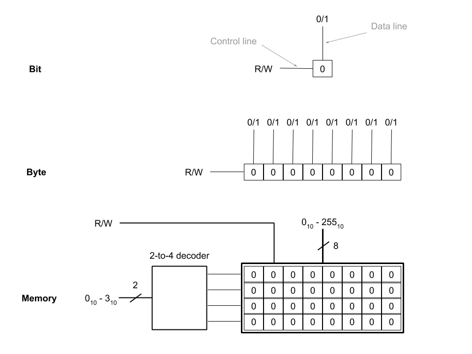
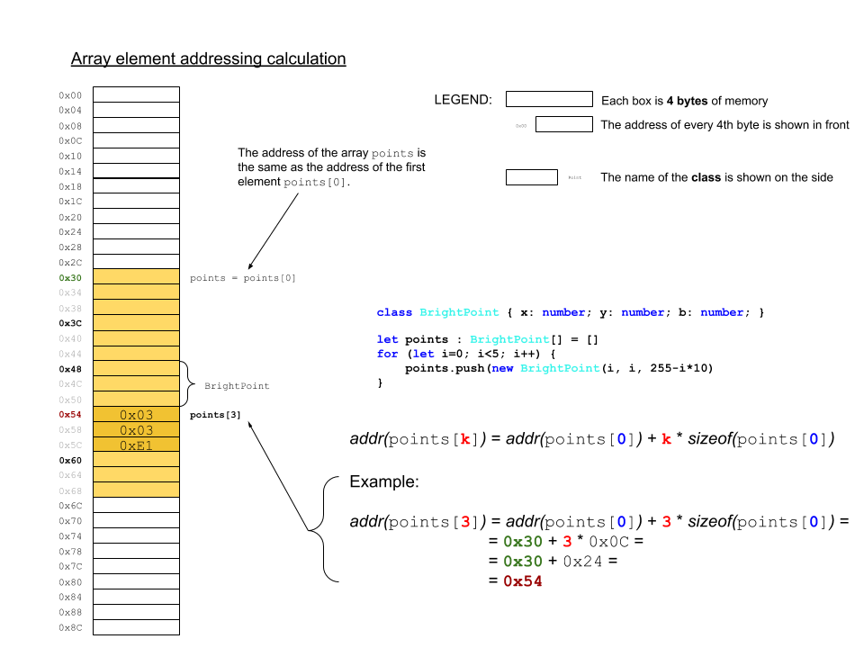
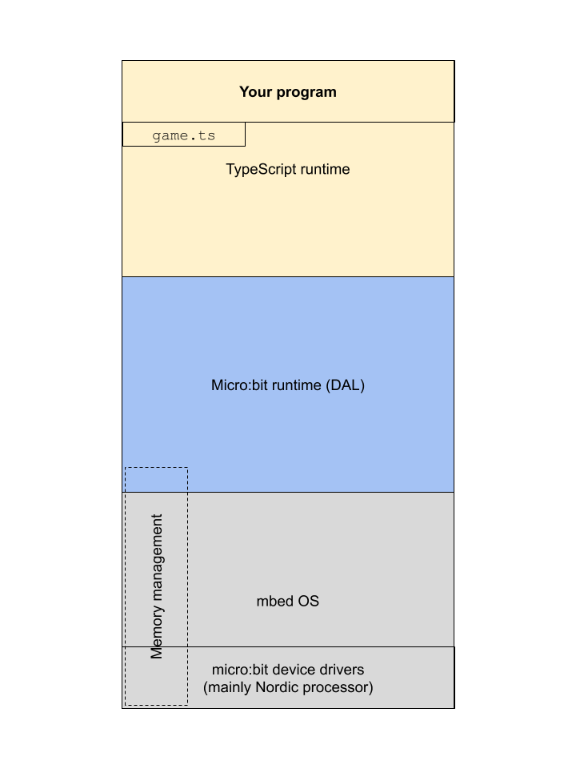
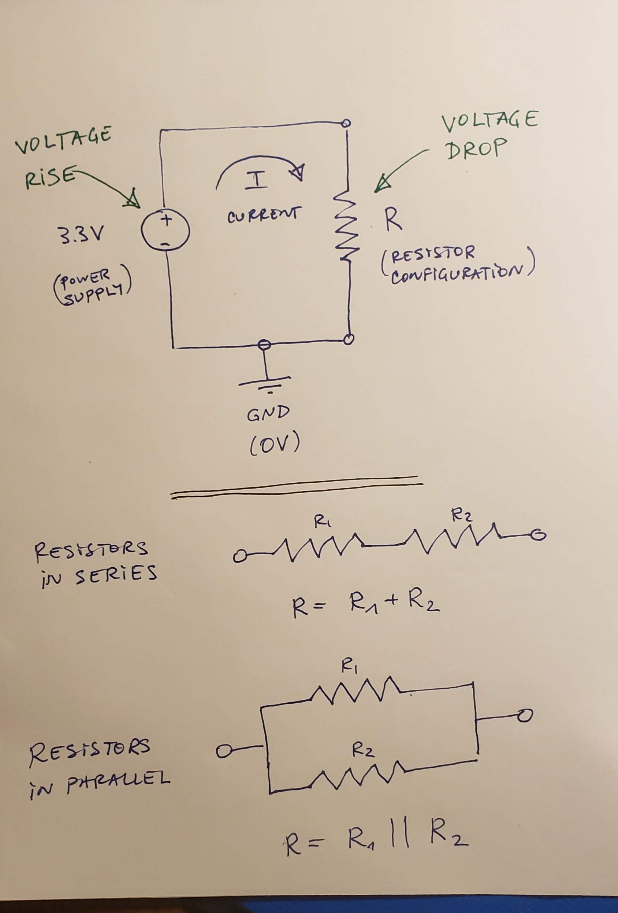
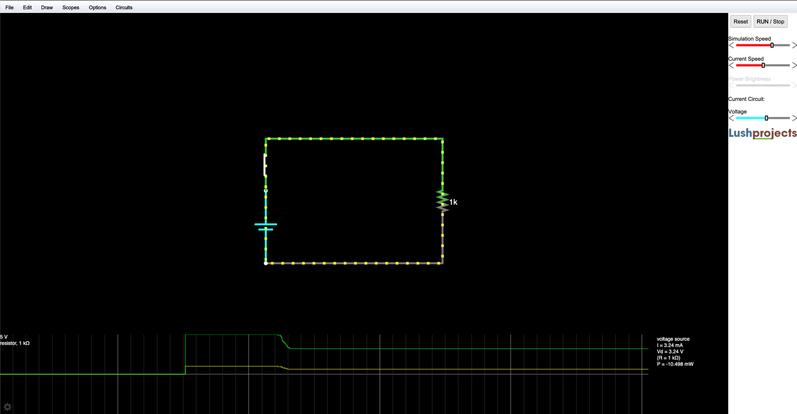
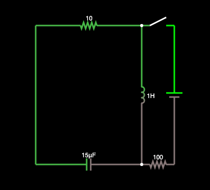
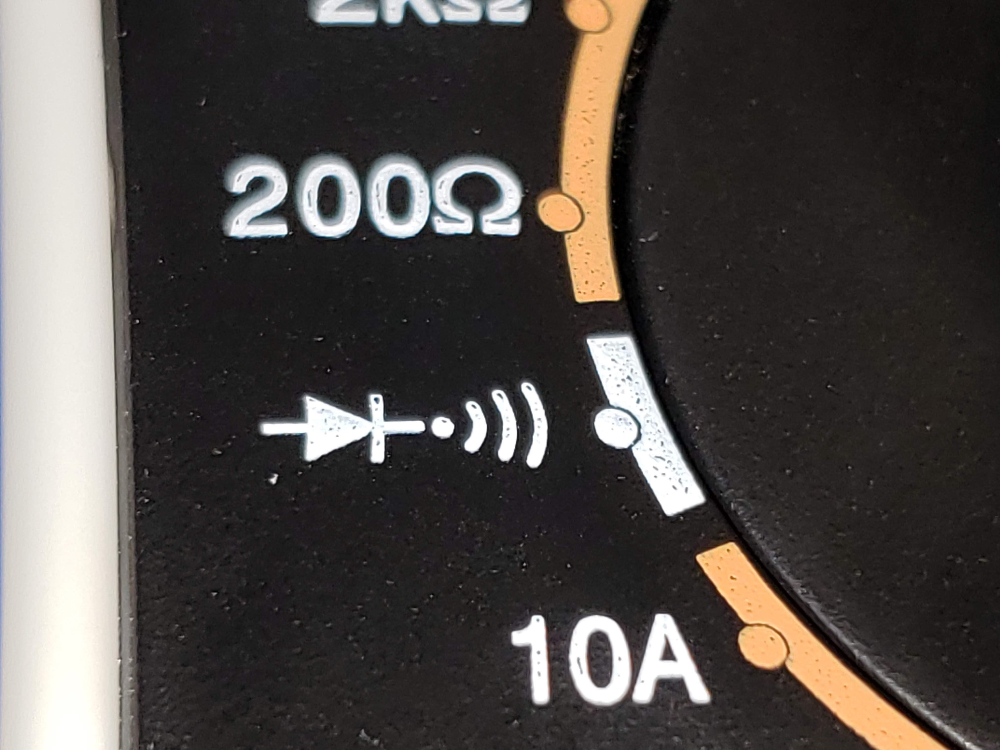

# CPE 1040 - Fall 2020

This is Learning Progression 004 of the course CPE 1040: Introduction to Computer Engineering at MSU Denver.


Table of Contents
=================

* [CPE 1040 \- Fall 2020](#cpe-1040---fall-2020)
  * [Learning Progression 004: External LEDs](#learning-progression-004-external-leds)
  * [Lab kit](#lab-kit)
    * [Parts for progression](#parts-for-progression)
  * [Steps](#steps)
    * [Step 1: Binary](#step-1-binary)
      * [1\. Study](#1-study)
        * [Positional numeral systems](#positional-numeral-systems)
        * [Unsigned integers](#unsigned-integers)
        * [Finite bit width](#finite-bit-width)
        * [Primitive data types revisited](#primitive-data-types-revisited)
        * [Signed integers](#signed-integers)
        * [IEEE 754 floating point](#ieee-754-floating-point)
      * [2\. Apply](#2-apply)
      * [3\. Present](#3-present)
    * [Step 2: Data &amp; memory](#step-2-data--memory)
      * [1\. Study](#1-study-1)
        * [Arrays and memory](#arrays-and-memory)
        * [Memory layout](#memory-layout)
        * [Numeric types, buffers, and caches](#numeric-types-buffers-and-caches)
        * [Addressing](#addressing)
        * [References and pointers](#references-and-pointers)
        * [Types of memory](#types-of-memory)
        * [Memory management](#memory-management)
      * [2\. Apply](#2-apply-1)
      * [3\. Present](#3-present-1)
    * [Step 3: Computation](#step-3-computation)
      * [1\. Study](#1-study-2)
        * [Addition](#addition)
        * [Subtraction in 2s complement](#subtraction-in-2s-complement)
        * [Shifting](#shifting)
        * [Multiplication](#multiplication)
        * [Floating point arithmetic](#floating-point-arithmetic)
      * [2\. Apply](#2-apply-2)
      * [3\. Present](#3-present-2)
    * [Step 4: Minimal assembly (part 1)](#step-4-minimal-assembly-part-1)
      * [1\. Study](#1-study-3)
        * [Central processing unit](#central-processing-unit)
        * [Instruction set architecture](#instruction-set-architecture)
        * [Registers](#registers)
        * [Processor and memory](#processor-and-memory)
        * [Load and store](#load-and-store)
        * [Branching revisited](#branching-revisited)
        * [Status bits](#status-bits)
        * [Clock cycles](#clock-cycles)
        * [Minimal instruction set CPU](#minimal-instruction-set-cpu)
          * [F\-4 MISC 16 bit instruction set](#f-4-misc-16-bit-instruction-set)
          * [In plain words](#in-plain-words)
          * [Symbols](#symbols)
        * [micro:bit hex files](#microbit-hex-files)
      * [2\. Apply](#2-apply-3)
      * [3\. Present](#3-present-3)
    * [Step 5: Minimal assembly (part 2)](#step-5-minimal-assembly-part-2)
      * [1\. Study](#1-study-4)
      * [2\. Apply](#2-apply-4)
      * [3\. Present](#3-present-4)
    * [Step 6: Electromagnetism](#step-6-electromagnetism)
      * [1\. Study](#1-study-5)
        * [Fundamental interaction](#fundamental-interaction)
        * [Electrostatics &amp; magenetostatics](#electrostatics--magenetostatics)
        * [Theories of electromagnetism](#theories-of-electromagnetism)
        * [Charge, voltage, and current](#charge-voltage-and-current)
        * [Resistance](#resistance)
        * [Ohm's law](#ohms-law)
        * [Power](#power)
      * [2\. Apply](#2-apply-5)
      * [3\. Present](#3-present-5)
    * [Step 7: Circuits &amp; circuit elements](#step-7-circuits--circuit-elements)
      * [1\. Study](#1-study-6)
        * [Circuits](#circuits)
        * [Short circuit](#short-circuit)
        * [Circuit elements](#circuit-elements)
        * [Resistors in series and in parallel](#resistors-in-series-and-in-parallel)
      * [2\. Apply](#2-apply-6)
      * [3\. Present](#3-present-6)
    * [Step 8: Multimeter](#step-8-multimeter)
      * [1\. Study](#1-study-7)
        * [Measuring voltage](#measuring-voltage)
        * [Different grounds](#different-grounds)
        * [Measuring current](#measuring-current)
        * [Measuring resistance](#measuring-resistance)
        * [Checking for continuity](#checking-for-continuity)
      * [2\. Apply](#2-apply-7)
      * [3\. Present](#3-present-7)
    * [Step 9: Basic LED circuit](#step-9-basic-led-circuit)
      * [1\. Study](#1-study-8)
      * [2\. Apply](#2-apply-8)
      * [3\. Present](#3-present-8)
    * [Step 10: micro:bit breakout board](#step-10-microbit-breakout-board)
      * [1\. Study](#1-study-9)
      * [2\. Apply](#2-apply-9)
      * [3\. Present](#3-present-9)
    * [Step 11: micro:bit GPIO pins](#step-11-microbit-gpio-pins)
      * [1\. Study](#1-study-10)
        * [micro:bit I/O](#microbit-io)
        * [Digital vs analog](#digital-vs-analog)
      * [2\. Apply](#2-apply-10)
      * [3\. Present](#3-present-10)
    * [Step 12: Screensaver extension](#step-12-screensaver-extension)
      * [1\. Study](#1-study-11)
        * [Extending a program](#extending-a-program)
        * [Defining extra rows](#defining-extra-rows)
        * [Choice of pins](#choice-of-pins)
      * [2\. Apply](#2-apply-11)
      * [3\. Present](#3-present-11)
  * [Resources](#resources)


## Learning Progression 004: External LEDs
[[toc](#table-of-contents)]  

This progression introduces fundamentals of computing, including the binary system of data representation as well as the basics of memory and processing. We introduce assembly language in the context of a minimal instruction set processor. This is where the lowest layer of the software stack and the highest layer of the hardware stack coexist, and where user programs are translated into machine code and executed by the processor one instruction at a time. This is also the level of computing which directly correpsonds to the simplest theoretical models of a computer. We also introduce the input-output capabilities of the micro:bit and build an external circuit to serve as an extension to the built-in 5x5 LED matrix to run our Screensavers program on.

## Lab kit
[[toc](#table-of-contents)]  

The lab kit is described in detail in a [separate page](lab-kit.md). Please, make sure you read the care and safety instructions embedded for most of the kit components.    

### Parts for progression  
[[toc](#table-of-contents)]  

1. Breadboard.  
2. Breadboard power supply with wall plug.  
3. micro:bit breakout board (connector).  
4. 330 Ohm resistor (10 count).  
5. LEDs (10 count).  
6. Wires.  
7. Multimeter with needle-tipped probes.  

## Steps
[[toc](#table-of-contents)]  

### Step 1: Binary   
[[toc](#table-of-contents)]

#### 1. Study
[[toc](#table-of-contents)]

##### Positional numeral systems
[[toc](#table-of-contents)]

`[<lernact-rd>]`The most widely used number system is `[<cept>]`_decimal_. What does "decimal" actually mean? Let us list the obvious:
1. [Decimal](https://www.etymonline.com/word/decimal) means 10.  
2. The decimal system has 10 symbols, called `[<cept>]`_digits_: 0, 1, 2, 3, 4, 5, 6, 7, 8, 8, 9.  
3. It's popularity tends to be attributed to the fact that humans have 10 digits on their hands and they learned to count on them in prehistoric times.  

Some aspects that are less obvious (mostly because they have become deeply habitual) are:
1. The name "decimal" indicates the `[<cept>]`_base_ of the number system, which is 10. Note that the base is the _highest digit plus 1_, which has to do with the fact that 0 is the first digit.      
2. Every number expresses a sum of `[<cept>]`_powers_ of the base 10. For example, the number 359 unequivocally means _three-hundred-and-fifty-nine_, or . Any decimal number can be expressed like this. Note that any number raised to the power 0 is, by definition, equal to 1.  
3. The powers of the base are equal to the indices of the digit positions, counting _from right to left starting at 0_. For example, 
   ```
   Digits     359
   Indices    210
   ```
   The position of a digit immediately tells us whether it represents _ones_. _tens_, _hundreds_, _thousands_, _ten-thousands_, etc.  

What all of this means is that the decimal number (aka `[<cept>]`_numeral_) system is just one example of `[<cept>]`_positional_ number systems. In contrast, the [Roman numeral system](https://en.wikipedia.org/wiki/Roman_numerals) is _not_ positional. For example, consider the numbers  (9 in decimal) and  (11 in decimal).

**Question 1.1.1:** Why are the Roman numerals not a positional number system?    

The `[<cept>]`[_binary_](https://en.wikipedia.org/wiki/Binary_number) number system (_binary_, for short) is another positional numeral system.

**Question 1.1.2:** What is the base of binary?  
**Question 1.1.3:** What are the symbols of binary? How are they called?     
**Question 1.1.4:** Express the binary number  as a sum of powers of the base.  
**Question 1.1.5:** What does  represent in binary?  

##### Unsigned integers
[[toc](#table-of-contents)]

`[<lernact-rd>]`The simplest data type in computing is the `[<cept>]`_unsigned integer_. "Unsigned" means `[<cept>]`_non-negative_. "Integer" means `[<cept>]`_whole number_. Here are the first 16 unsigned integers, in both decimal and binary:
Decimal | Binary
-- | --
 | 
 | 
 | 
 | 
 | 
 | 
 | 
 | 
 | 
 | 
 | 
 | 
 | 
 | 
 | 
 | 

In programming, a binary number is written with the prefix `0b`. For example, `0b1` and `0b0001` both represent . 

**Question 1.1.6:** What are the `[<cept>]`_bit patterns_ for , , and ? Use the following function on the micro:bit simulator and/or device:
```javascript
// Example 1.1.1

/**
 * Converts an unsigned decimal integer to a binary bit pattern string.
 * 
 *           Quotient     Remainder   Condition          Result
 *   3 : 2 = 1.5  ------> 1           Q > floor(Q)       11
 *   1 : 2 = 0.5  ------> 1           floor(Q) == 0 
 *
 *   2 : 2 = 1.0  ------> 0           Q == floor(Q)      10
 *   1 : 2 = 0.5  ------> 1           floor(Q) == 0
 *
 * @param dec unsigned decimal integer
 */
function toUnsignedBinaryString(dec : number) : string {
    let bin_array : number[] = []
    let quotient : number = dec
    let no_fraction : number

    while (true) {
        quotient /= 2
        no_fraction = Math.floor(quotient)
        if (quotient > no_fraction)
            bin_array.insertAt(0, 1)
        else
            bin_array.insertAt(0, 0)
        if (no_fraction == 0) break
        quotient = no_fraction
    }

    return '0b' + 
           bin_array.map(
               (value: number, index: number) => 
               { return value.toString(); }
               ).join('')
}
```

##### Finite bit width   
[[toc](#table-of-contents)]

`[<lernact-rd>]`A bit pattern of _any length_ can represent an unsigned integer. However, computers represent unsigned integers of `[<cept>]`_fixed bit width_, which is a power of 2. The most widely used bit widths are 8, 16, 32, 64, and 128. For example, here is the number  in 8 bits, 16 bits, and 32 bits:
Bit width | Bit pattern
-- | --
8 | `0b10101100`
16 | `0b0000000010101100`
32 | `0b00000000000000000000000010101100`

The micro:bit has 32-bit unsigned integers.

**Question 1.1.6:** What is the bit pattern of the largest unsigned integer that can be represented in the micro:bit?  

Finite bit-width means a limit on the largest number that can be represented. If a number is larger than the largest number that can be represented in the available number of bits, it `[<cept>]`_overflows_.

**Question 1.1.8:** Will  overflow in 8-bit binary?   

##### Primitive data types revisited
[[toc](#table-of-contents)]

The unsigned integer is one of the `[<cept>]`_primitive_ data types, along with _signed integers_, _floating-point numbes_, and _booleans_. A data type is primitive if it is represented in a `[<cept>]`[_word_](https://en.wikipedia.org/wiki/Word_(computer_architecture)). More on this when we tackle memory addressing and processor arithmetic in later steps.

**Question 1.1.9:** What is the word size of the micro:bit? _Hint: There are three ways to tell: (i) Reread the last two sections carefully; (ii) In the Wikipedia page, look at the table and find ARMv6-M, the architecture of the micro:bit processor; and (iii) Skim-read the [hardware overview](https://tech.microbit.org/hardware/1-5-revision/) documentation page for the micro:bit._  

##### Signed integers
[[toc](#table-of-contents)]

`[<lernact-rd>]``[<cept>]`_Signed integers_ are integers that can be negative and non-negative.

**Question 1.1.10:** How many different numbers can we represent with 4-bit binary patterns?  

There are several [ways](https://en.wikipedia.org/wiki/Signed_number_representations) we can represent negative numbers. Here are examples with 4-bit numbers:
1. _Sign and value._ For example, if `0b0011` represents , then   will be represented by `0b1011`. The leftmost bit is used as a sign, with 0 representing + and 1 representing -. The problem with this representation is that it complicates computer arithmetic in `[<cept>]`_hardware_.      

2. _One's complement_. For example,  will be represented by `0b1100`. The bits are just flipped. The problem with this representation is that it ends up with two different zeros: `0b0000` represents  and `0b1111` represents .  
3. [_Two's complement_](https://en.wikipedia.org/wiki/Two%27s_complement). This is the representation of choice for modern computers because it eliminates the problems of the previous two. For example,  is represented by `0b1101`.  

Here is a short table of 2-bit numbers in decimal and the three binary representations (note that with 2 bits we can represents only 4 different numbers):
Decimal | Sign and value | 1s complement | 2s complement
-- | -- | -- | --
 | `0b01` | `0b01` | `0b01`
 | `0b00` | `0b00` | `0b00`
 | `0b10` | `0b11` | n/a
 | `0b11` | `0b10` | `0b11`
 | n/a | n/a | `0b10`

The signed integer is also a primitive type.

**Question 1.1.11:** If we can represent 32 different signed integer numbers, what is the largest (by absolute value) negative number that we can represent?  

##### IEEE 754 floating point  
[[toc](#table-of-contents)]

`[<lernact-rd>]`There are many different ways to represent `[<cept>]`_real_ numbers in binary, but the established standard is the [IEEE 754 format](https://en.wikipedia.org/wiki/Single-precision_floating-point_format). The full coverage of this standard is beyond the scope of this learning progression, so we will point out the most important elements:

1. The standard is based on the `[<cept>]`[_scientific notation_](https://www.mathsisfun.com/numbers/scientific-notation.html) for real numbers. For example:  
   1. The decimal real number  will be written in scientific notation as . 
   2. For binary, analogously, the number  will be written in scientific notation as . _Note that, for clarity, we follow the convention for writing the base and power in decimal!_   
   3. Finally, the number  will be represented in scientic notation as .  

2. The type is called "_floating_ point" precisely because the exponent can take a large range of signed integers, as shown in the examples above, which allows the fractional point to "float". In contrast, reals can be represented in `[<cept>]`_fixed-point_ format, as well, thought his format has narrower application.  

3. The `[<cept>]`_single-precision_ floating point is a primitive type represented in 32 bits. The `[<cept>]`_double-precision_ floating point is a primitive type represented in 64 bits.  

4. In either precision, the bit pattern is split in 3 sections, representing (with bit widths shown for single-precision) as follows:

   1. (1 bit) The sign, either 0 (+) or 1 (-). For the first binary example above, this bit woulb be 1.    

   2. (8 bits). The `[<cept>]`_exponent_ (that is, the power). The exponent is represented in an `[<cept>]`_offset_ form (aka `[<cept>]`_excess_, aka `[<cept>]`_bias_) where 127 is added to the actual exponent (aka _excess-127_). In the first binary example, the 8-bit exponent in our example above will be . This offset form converts the signed number representing the exponent (we saw that the exponent can be both negative and non-negative) into an unsigned number, which helps with `[<cept>]`_sorting_ floating-point numbers.  
   
   3. (23 bits) The `[<cept>]`_significand_ (aka `[<cept>]`_mantissa_), which consists of the bits _after_ the `[<cept>]`_binary point_ (aka fractional point). In the first binary example, the fractional bit pattern is going to be `01011000000000000000000`. Note that because in scientific notation a binary number always has a 1 bit to the left (aka in front) of the fractional point, it is omitted from the representation.    

5. Floating-point numbers are `[<cept>]`_inexact_. Because the significand has only 23 bits, any further precision is lost and rounded. Real numbers are `[<cept>]`_uncountably infinite_, but we can only represent a finite number of them.  

**Question 1.1.12:** Why would it be easier to sort binary floating-point numbers with the exponent represented as an _unsigned integer_ rather than a _signed integer_? _Hint: In an ascending order, 0 sorts above 1, but signed integers that start with 1 are all smaller than any signed integer that starts with 0._

#### 2. Apply
[[toc](#table-of-contents)]

1. `[<lernact-prac>]`Explain in detail (line by line) what the function in Example 1.1.1 does and why.    

2. `[<lernact-prac>]`Write a function that converts a _binary pattern string_, like `01011001`, to a decimal number (which will be 89 in this case).  _Hint: Sum of powers of the base, with a judicious choice of [string methods](https://www.tutorialspoint.com/typescript/typescript_strings.htm), which can be found under the **Text** bar in the **Advanced** section of the MakeCode menu._  

3. `[<lernact-prac>]`**[Optional challenge, max 10 extra step points]** Write a program with the following functions and types:
   1. Function `asUnsigned` to interpret an 8-bit binary pattern string as an unsigned integer and return the decimal equivalent.  
   2. Function `asOnesComp` to interpret an 8-bit binary pattern string as a 1s-complement signed integer and return the decimal equivalent.  
   3. Function `asTwosComp` to interpret an 8-bit binary pattern string as a 2s-complement signed integer and return the decimal equivalent.  
   4. Function `asUnsignedAny` to interpret a binary pattern string of arbitrary bit length as an unsigned integer and return the decimal equivalent.  
   5. Function `asOnesCompAny` to interpret a binary pattern string of arbitrary bit length as a 1s-complement signed integer and return the decimal equivalent. _Note: You will need to assume that the bit width is the smallest power of 2 larger or equal to the number of bits in the argument. You will need to read up on [sign extension](https://en.wikipedia.org/wiki/Sign_extension)._      
   6. Function `asTwosCompAny` to interpret a binary pattern string of arbitrary bit length as a 2s-complement signed integer and return the decimal equivalent. _See the note above._    
   7. Enumerated type `NumberRep` for the three different representations: `Unsigned`, `OnesComp`, and `TwosComp`.  
   8. Enumerated type `BitWidth` for the two cases of bit width in the above functions: `8` and `Any`.  
   9. Function `interpretBinary (pattern : string, repr : NumberRep, width : BitWidth)` to collect all functions in one.  

4. `[<lernact-prac>]`**[Optional challenge, max 3 extra step points]** Write a function `toScientific` that takes a real number and shows (that is, scrolls) it on the micro:bit screen in decimal scientific notation.  

5. `[<lernact-prac>]`**[Optional super challenge, max 16 extra step points]** Derive the 2s-complement representation of signed binary integers. Recommended progression:
   1. Realize that with any fixed number of bits, you can only represent so many different numbers.  
   2. Represent the unsigned integers for a bit width of your choice (4+ recommended, power of 2 recommended).  
   3. Now that you have all the patterns listed in a particular order, find one feature that splits the set in two, with all other features the same. _Hint: The two sets should easily convert from one to the other using a bitwise operation._    
   4. One of the sets would obviously remain to represent the same non-negative numbers as before the split. The other can now be used to represent the negative numbers.   
   5. How will you order the two sets so that they are symmetric through application of the bitwise opration from (3)?  
   6. At this point, you should have arrived at 1s-complement signed integers of the bit width you chose in (2). Point out the problem with it.  
   7. The foremost design principles for a number representation is that it is _arithmetically correct_ and _computationally cheap_. How would you fix the problem you pointed out in (6) in accordance to these principles. _Hint: Flipping a bit is cheap. Adding 1 to a number is cheap._  
   8. Show the sequence of _cheap_ operations that will _correctly_ compute 95<sub>10</sub> - 37<sub>10</sub>, in 2s-complement binary. _Hint: The silent overflow is a feature, not an error!_  

#### 3. Present
[[toc](#table-of-contents)]

In the [programs](programs) directory:
1. Add your program from 1.2.2 with filename `microbit-program-1-2-2.js`.  
2. Add your program from 1.2.3 with filename `microbit-program-1-2-3.js`.  
3. Add your program from 1.2.4 with filename `microbit-program-1-2-4.js`.  

In the [Lab Notebook](README.md):

1. Answer question 1.1.1.  
2. Answer question 1.1.2.  
3. Answer question 1.1.3.  
4. Answer question 1.1.4.  
5. Answer question 1.1.5.  
6. Answer question 1.1.6.  
7. Answer question 1.1.7.  
8. Answer question 1.1.8.  
9. Answer question 1.1.9.  
10. Answer question 1.1.10.  
11. Answer question 1.1.11.  
12. Answer question 1.1.12.  
13. Write you narrative for the program explanation from 1.2.1.  
14. Link to the program from 1.2.2.  
15. Link to a demo video showing the execution of the program from 1.2.2.  
16. Link to the program from 1.2.3.  
17. Link to a demo video showing the execution of the program from 1.2.3.  
18. Link to the program from 1.2.4.  
19. Link to a demo video showing the execution of the program from 1.2.4.  
20. Write you narrative for the derivation from 1.2.5.  

### Step 2: Data & memory  
[[toc](#table-of-contents)]

#### 1. Study
[[toc](#table-of-contents)]

##### Arrays and memory
[[toc](#table-of-contents)]

`[<lernact-rd>]`Arrays are a ordered collections of data elements, which allow individual elements to be retrieved by their index in the sequence. The index range is [0, N-1], where N is the total number of array elements. Arrays are a close analog to computer memory. Memory is organized as a large array, and the indices of the elements are called `[<cept>]`_addresses_. Each `[<cept>]`_byte_ (8-bits) has an address, starting from 0b000 up to the highest address depending on the size of the memory.

What do we mean by "memory"? Memory is a physical device capable of keeping a dynamic record of the `[<cept>]`_state_ of a `[<cept>]`_process_ (meaning, an activated program). The state includes all the data the process is working with. For a computer to execute a program, the program itself and the program's data needs to be in the computer's memory.

Here's a very simple sketch of memory, showing all the bits (shown as boxes) in 4 consecutive bytes with addresses shown on the left:
```
       -----------------
0b0000 |0|1|1|1|0|0|0|0|
       -----------------
0b0001 |1|1|0|1|0|1|1|0|
       -----------------
0b0010 |1|0|0|0|1|1|0|1|
       -----------------
0b0011 |0|0|1|1|0|0|1|0|
       -----------------
```
Notice the _fixed bit width_ of data in memory.

Memory has only two basic functions, `[<cept>]`_Read_ and `[<cept>]`_Write_.

The most important property of memory is `[<cept>]`_speed_, in both reading and writing. The second most important property of memory is `[<cept>]`_capacity_. The more memory a computer has, the better. In the age of `[<cept>]`_big data_, memory is never enough, often by `[<cept>]`_orders of magnitude_.

##### Memory layout  
[[toc](#table-of-contents)]

The simplicity of memory devices shift the burden of efficient usage to the software stack. Let's list some of the computational artifacts that we write to and read from memory:
1. We know that memory is `[<cept>]`_byte-addressed_. Any byte-sized data fits very efficiently into memory. Here are two examples:
   1. [ASCII characters](http://www.asciitable.com/), which are a standard character set used by **all programming languages**, are 7-bits long. This character set is `[<cept>]`_fixed-length_, where length referes to the number of bytes one character takes. They all take one byte. In contrast, `[<cept>]`[_Unicode_](https://home.unicode.org/), which is the worldwide standard for representing all symbolic systems used by humanity, including [emoji](https://unicode.org/emoji/charts/full-emoji-list.html), due to its size, has adopted a `[<cept>]`_variable-length_ format.  
   2. `[<cept>]`_Machine learning (ML)_ has become an ubiquitous technology and is utilized in all computing environments, from large data centers to the smallest resource-constrained `[<cept>]`_Internet-of-Things (IoT)_ devices on the `[<cept>]`_edge_ of the Internet. ML is a `[<cept>]`_memory-heavy_ (meaining it uses a lot of memory) technology, but in the latter case, memory is severly constrained. The computational artifacts that ML produces are called `[<cept>]`_models_. These models contain the learned knowledge which machines use to solve the problems they were `[<cept>]`_trained_ for. The models are large and complex `[<cept>]`_data structures_. To be able to use such a model on IoT devices, it has to be `[<cept>]`_compressed_ to fit in their limited memory. One of the techniques is `[<cept>]`_byte-packing_, which reduces the numerical data of the model to a `[<cept>]`_byte array_.  
2. Except for memory-constrained applications, data is usually represented in `[<cept>]`_words_. Today a word is usually 4 bytes, or 32 bits. All `[<cept>]`_primitive data types_ are represented in words, meaning:
   1. They are read from and written to memory as words.  
   2. The processor works with word-sized `[<cept>]`_operands_ (e.g. for addition `a + b`, where `a` and `b` are the operands).  
   3. Because both memory and processor work with words, the computer is optimized to work with words, thus making the word-sized data the most efficient to manipulate.  
3. The primitive types that we have encountered are:
   1. Unsigned integers.  
   2. Signed integers.  
   3. Single-precision floating-point numbers.  
   4. Double-precision floating-point numbers (which use 2 words instead of one).  
   5. Booleans.  
      All of these look like bit-patterns in binary. For example, the bit pattern:
      ```
             -----------------------------------------------------------------
      0b0000 |1|0|0|1|1|1|1|1|1|1|1|0|0|0|0|0|0|0|0|0|0|0|0|0|0|0|0|0|0|0|0|0|
             -----------------------------------------------------------------
      ```
      represents 2682257408<sub>10</sub> in unsigned integers, -1612709888<sub>10</sub> in signed integers, or -9.48676900925e-20 in floating-point numbers. _Note that the last number is an example of a short-hand representation of scientific notation. The `e-20` means * 10<sup>-20</sup>._ So, data types are important to distinguish between different interpretation of binary patterns in memory.   
4. Booleans are an interesting case. While a single bit can represent a boolean (0 for `false` and 1 for `true`), memories cannot manipulate (read or write) single bits. So, booleans are represented either by bytes, which are the smallest addressable units of memory, or words, which are the most efficient memory unit. Very often, data that are narrower than words are `[<cept>]`_word-aligned_ (meaning they are stored in words, with any extra bits set to zero). For example, here is how 4 word-aligned booleans will look in memory (the first two are `false` and the last two are `true`):
   ```
          -----------------------------------------------------------------
   0b0000 |0|0|0|0|0|0|0|0|0|0|0|0|0|0|0|0|0|0|0|0|0|0|0|0|0|0|0|0|0|0|0|0|
          -----------------------------------------------------------------
   0b0004 |0|0|0|0|0|0|0|0|0|0|0|0|0|0|0|0|0|0|0|0|0|0|0|0|0|0|0|0|0|0|0|0|
          -----------------------------------------------------------------
   0b0008 |0|0|0|0|0|0|0|0|0|0|0|0|0|0|0|0|0|0|0|0|0|0|0|0|0|0|0|0|0|0|0|1|
          -----------------------------------------------------------------
   0b000c |0|0|0|0|0|0|0|0|0|0|0|0|0|0|0|0|0|0|0|0|0|0|0|0|0|0|0|0|0|0|0|1|
          -----------------------------------------------------------------
   ```
   Notice the addresses. They are 0<sub>10</sub>, 4<sub>10</sub>, 8<sub>10</sub>, and 12<sub>10</sub>, because each boolean is 4 bytes wide.  
5. The individual elements of arrays are stored `[<cept>]`_consecutively_ in memory. For example, the previous example may very well be the memory layout of the array `let boolArr : boolean = [false, false, true, true]` provided the micro:bit uses word alignment for booleans.
6. Object data is stored in memory blocks with the cumulative size of the class fields. The following sketch shows this for some familar classes from previous steps:

     

7. Of course, program code is also stored in memory. Here we need to distinguish among the following:
   1. Program source code is stored as regular files in the file system, usually on drives, known as `[<cept>]`_secondary storage_. For example, `screensavers.js` is a source file.    
   2. Program `[<cept>]`_compiled_ binaries are stored as regular (though non-human readable) files, usually in _secondary storage_. For example, `microbit-screensavers.hex` is a compiled binary.  
   3. When a program is activated for execution, and becomes a `[<cept>]`_process_, the following happens:
      1. A process metadata block is created for the program. This contains addresses, identification numbers, and miscellaneous process management data.    
      2. The program's compiled binaries are brought to `[<cept>]`_main memory_ (aka `[<cept>]`_primary storage_, the memory we have been talking about so far) in a `[<cept>]`_code segment_.  
      3. The program's data is also brought to main memory, in a data segment.  
      4. Additional memory for the program's execution is allocated and assigned to it.  
      5. Using the process metadata block, the process is put on a `[<cept>]`_queue_ (which is just a list where elements are added from one end and removed from the other) of processes ready to execute.  
8. Just as variables are named data, functions and class methods are named code. When a function or method is called, the process knows where the code is. For class methods, they are not stored for each object, but only once for the class. When a method is called on an object, the class code is executed.

##### Numeric types, buffers, and caches
[[toc](#table-of-contents)]

The MakeCode environment silently lumps both integer and floating-point numbers in its `number` type. _Note that the type [`Number`](https://makecode.microbit.org/types/number) (note the capitalized type name) is a 32-bit 2s-complement signed integer, and its support is not very stable at present. Most importantly, the two types `number` and `Number` are not compatible and/or mutually interconvertible, at least in MakeCode, where the [JavaScript-like language we are using to program the micro:bit](https://makecode.com/language) is only a **subset** of TypeScript. For example:_
```javascript
// Example 2.1.1

let f : number = 3.4
basic.showNumber(f)  // this works fine as showNumber takes a `number`-typed argument

let f : Number = 3
basic.showNumber(f)  // this errors out with message "Argument of type 'Number' is not assignable to parameter of type 'number'."
```
So, we can use `Number` variables in our programs, but we cannot use them as arguments to functions which have `number` parameters.

TypeScript (in contrast to JavaScript) supports unsigned and signed integer types with explicit fixed bit-widths:
```javascript
// Example 2.1.2

// Unsigned integer types
let a : uint8                     // range 0 to 255
let b : uint16                    // range 0 to 65536
let c : uint32                    // range 0 to 4294967295

// Signed integer types
let x : int8                      // range -128 to 127
let y : int16                     // range -32768 to 32767
let z : int32                     // range -2147483648 to 2147483647
```
Note the following:
1. The ranges differ in correspondence to the bit width of the type: the larger the width, the larger the range.    
2. The signed integers are 2s-complement, as can be seen from the fact that the negative integers are one more than the positive ones.  

Arrays are not currently supported for these types. Instead of arrays, we can use `[<cept>]`_buffers_, which in general are unstructured blocks of memory where the programmer has full control over the memory layout. MakeCode supports the type [`Buffer`](https://makecode.microbit.org/types/buffer) for just such purpose. Here is an example:
```javascript
// Example 2.1.3

const BUFF_BYTE_SIZE = 16
let buff : Buffer = pins.createBuffer(BUFF_BYTE_SIZE)

for (let i=0; i<BUFF_BYTE_SIZE; i++) buff.setNumber(NumberFormat.Int8LE, i, 10 * i)

basic.showString("The buffer has size " + buff.length + "bytes")

// Interpret as bytes
basic.showStrint("The contents, in signed bytes, are:")
for (let i=0; i<BUFF_BYTE_SIZE; i++) basic.showNumber(buff.getNumber(NumberFormat.Int8LE, i)

// Interpret as integers
basic.showStrint("The contents, in signed integers, are:")
for (let i=0; i<BUFF_BYTE_SIZE; i+=4) basic.showNumber(buff.getNumber(NumberFormat.Int32LE, i)
```
The buffer works very much like regular memory:
1. It is initialized as some number of _bytes_.  
2. Each of these bytes is individually addressable by index (the second argument of the `setNumber` and `getNumber` functions).  
3. The bytes can be interpreted as parts of [wider types](https://makecode.microbit.org/types/buffer/number-format), e.g. 32-bit signed integers, as shown in the example. Note the step of 4 of the last `for` loop.    

Buffers are best used as transient storage in applications which require a `[<cept>]`_cache_. A cache is small but fast storage for the most often used computational artifacts and data. Two example applications for buffers are:
1. In input-output operations, data has to travel across a communication channel (usually 1, 2, 3, or more parallel wires, depending on the application). The speed of the channel is usually measured in bits per second (abbr. bps or bits/sec). If the speed of the channel does not match the speed of generation of output data or processing of input data, data would be lost. Buffers can be used to temporarily store data that might otherwise be lost, until the slower side of the buffer catches up with the faster side.  
2. Some functions, especially recursive functions, perform expensive computations and are, on top of that, inefficient. The innefficiency often comes from having to do the same computation multiple times. It's much better to keep a buffer with results of expensive computations, to speed up the overall processing speed. The buffer can be [passed by reference](#references-and-pointers) to the recursive calls.  

More generally, a cache is a small set of objects, which are made available _much faster_ than from their general storage and _much closer_ (physically) to where they are needed. Thus, `[<cept>]`_caching_ is a widely used algorithmic principle, in computing and widely in engineering.  

##### Addressing  
[[toc](#table-of-contents)]

The following sketch illustrates how memory is accessed:

  

Things to notice:
1. The control line determines if the access is for reading (R) or writing (W). This is usually a single line (that is, 1 bit).    
2. The data lines carry the value to be written or the value read, depending on the control line. It is as wide as there are bits (either 1 or 8 on the sketch).  
3. When accessing a single bit or a single byte, we do not need address lines.  
4. The address lines carry the value of the address. They are as many as necessary. On the bottom of the sketch, we have 8 bytes, each of which can be read or written independently. For this to happen, it needs to be `[<cept>]`_exclusively_ selected (that is, it and only it is selected, with the others deselected). For 4 different selector lines (one for each of the bytes), we can have a 2-bit address. Why? Because 4 different numbers can be represented with 2 bits (`0b00`, `0b01`, `0b10`, and `0b11`). The `[<cept>]`_2-to-4 decoder_ is a circuit which performs the following translation:

Address (2 bits) | Selector (4 bits)
--- | ---
00 | 0001
01 | 0010
10 | 0100
11 | 1000

A line is selected when it carries a value of 1 and deselected when it carries a value of 0.  

**Question 2.1.1:** How many different selector lines can we control (that is, decode) with a 4-bit address?  

##### References and pointers
[[toc](#table-of-contents)]

Now that we know about memory addresses, we can recall the short mention of references from a previous step. References are the programmatic equivalents of addresses, a sort of "invisible addresses". When arguments are passed to a function, they are either copied (pass `[<cept>]`_by value_) or referenced (pass `[<cept>]`_by reference_). To the programmer, this difference is invisible in most languages, JavaScript included. The difference is implemented based on the type of the argument: pass by value for primitive types, pass by reference for arrays and objects. While the programmer does not see the addresses themselves, reference-type `[<cept>]`_identifiers_ (meaning variable and function names) are matched to memory addresses when a program is activated and executed.

Some languages, most notably C and C++, have explicit reference types, called `[<cept>]`_pointers_. Here is a small example:
```c
// Example 2.1.4

int i = 6;                                                 // just a 32-bit signed integer variable, with a type `int`
int *ptr = &i;                                             // a pointer variable, also 4 bytes, holding the address of i
                                                           // the type of ptr is `int *`, a pointer to an integer

printf("Integer %d, pointer dereference %d\n", i, *ptr);   // a pointer can be dereferenced to show the value at the address it holds
```
Thus, languages like C and C++ give very low-level control over program memory than most other languages, including Java and JavaScript, where memory operations are invisible to the programmer and out if their direct control.

##### Types of memory
[[toc](#table-of-contents)]

The elements of an array are stored in memory `[<cept>]`_continguously_ (meaning one after the other without gaps). This supports a very simple and efficient mechanism for element selection by index. The address of a particular element is calculated with the formula _base address + index * base type size_. Here is a sketch for illustration:

  

There is a most important consequence of this mechanism, namely that the access of any element takes `[<cept>]`_constant time_ (meaning it doesn't depend on the size of the array or the size of the individual elements or their order or their particular index).

Memory works the same way: any address is accessed as fast as any other. This is important during execution, because a process has code and data in different segments of memory, sometimes far apart from each other. As a process executes, it tends to access memory at random. This is called `[<cept>]`_random access_, which gives the primary-storage (aka `[<cept>]`_main_) memory the name `[<cept>]`_Random Access Memory (RAM)_. The current version of the micro:bit has [16KB](https://tech.microbit.org/hardware/1-5-revision/#nrf51-application-processor) (read as 16 `[<cept>]`_kilobytes_) of RAM. The upcoming [version 2](https://tech.microbit.org/hardware/#nrf52-application-processor) has 128KB, or 8 times larger. A [modern machine learning workstation](https://lambdalabs.com/gpu-workstations/vector/customize) can have up to 256GB (read as 256 `[<cept>]`_gigabytes_), or about 16 million times larger than the current micro:bit.  

RAM, usually called main memory, is used as dynamic data storage **only** during process execution. It is `[<cept>]`_volatile_ memory (meaining the data is lost when the device is turned off). This is so for the micro:bit as well. One of the first significant programs written for the micro:bit shortly after its launch, the game [`Bitflyer`](https://hackernoon.com/the-first-video-game-on-the-bbc-micro-bit-probably-4175fab44da8) shows the layout of the 16KB of RAM (it lacks a table of contents, so just find the **Memory** section) in color, pointing out the different regions and their clients. Note that this is just a snapshot and is not the permanent structure of the RAM, which is just a large array. All data in the array needs to be interpreted by the memory client to make sense. (Note that this is for a program written in MicroPython, not TypeScript.)

The micro:bit stores its programs in a different memory device, which is called [Flash ROM](https://tech.microbit.org/hardware/1-5-revision/#nrf51-application-processor), of which v1.5 has 256KB and v2 has 512KB. Let's unpack this:
1. [Flash](https://en.wikipedia.org/wiki/Flash_memory) is a type of memory device. It is `[<cept>]`_non-volatile_ (meaning the data doesn't get erazed when the device is turned off). Disconnecting the micro:bit from the battery pack and the USB cable turnes it off, but the program on it doesn't get lost or change until the device is back on and re-programmed.  
2. ROM stands for `[<cept>]`_Read-Only Memory_, which is self-explanatory. The program code is only read from the Flash ROM during process execution.  
3. The Flash ROM, of course, is not a memory to which we cannot write at all. The process of programming the micro:bit (by "dropping" the hex file onto the micro:bit "drive") is a process of _writing_ the program memory. It is performed by the so called [interface chip](https://tech.microbit.org/hardware/1-5-revision/#interface), which mediates between the USB channel, connected to the programming computer, and the [application processor](https://tech.microbit.org/hardware/1-5-revision/#nrf51-application-processor). The process is shown schematically on the [micro:bit software overview page](https://tech.microbit.org/software/) and described in more detail [here](https://tech.microbit.org/software/daplink-interface/). The interface chip has a program, called `[<cept>]`[_firmware_](https://microbit.org/get-started/user-guide/firmware/), which receives the program in the form of a HEX file and programs the application processor.

##### Memory management
[[toc](#table-of-contents)]

Memory management, for both RAM and ROM, is usually implemented in the lowest levels of the software stack, as shown in the familiar sketch:



This is because of the following crucial roles of memory in a computer:
1. **Isolation.** The memory regions of different processes have to be isolated, and this include no exposing memory management functions to the programmatic layer of the stack.  
2. **Speed.** The processor of a computer runs much faster than the memory management mechanisms. Therefore, in order to keep the processor busy, the computer's memory is built as a hierarchy of hardware and software components. The following diagram shows the memory pyriamid with various components we mentioned:

     

   [[Image credit](https://en.wikipedia.org/wiki/Memory_hierarchy)]  


#### 2. Apply
[[toc](#table-of-contents)]

1. `[<lernact-prac>]`The `[<cept>]`_hexadeximal_ number system is frequently used in computing (e.g. the micro:bit HEX files, and to show memory addresses that are too big to show in binary). "Hexadeci-" means 16. Questions and tasks:  
   1. What is the base of hexadecimal?  
   2. What are the symbols of hexadecimal? List them.  
   3. How many bits can represent the same number of different numbers as one `[<cept>]`_hexadigit_?  
   4. Using your answer to the previous question, describe a simple procedure to convert numbers from binary to hexadecimal, and vice versa.  

2. `[<lernact-prac>]`Write a function `bin2Hex(bin : string) : string` which takes a binary integer string and returns the corresponding hexadecimal integer string (e.g. for input `0b00001111`, the output is `0x0F`). Guidelines and hints:
   1. Assume the argument `bin` will have the prefix for binary.  
   2. You might need to `[<cept>]`_pad_ the argument string. What is padding? If I need a string to be of some particular length (or width for binary number strings), say 8 bits, and I have an input like `0b111`, I can pad this string on the left with `0`-s to get the equivalent 8-bit number strging `0b00000111`.  
   3. The output string should have the prefix for hexadecimal.  

3. `[<lernact-prac>]`Write a function `hex2Bin(hex : string) : string` which takes a hexadecimal integer string and returns the corresponding binary integer string (e.g. for input `0x0F`, the output is `0b00001111`). Use prefixes.  

4. `[<lernact-prac>]`**[Optional challenge, max 5 extra step points]** `[<cept>]`_Databases_ are large containers for data, usually organized in `[<cept>]`_tables_. Tables resemble multidimensional arrays with the important difference that different `[<cept>]`_columns_ may have different data types. One of the drawbacks of arrays and database tables is that sorting them in place is inefficient. It takes a lot of copying, consuming memory and processing time. So what do we do if we have a database table that is already sorted by, say, record identification number, and is too large to sort otherwise? How can we still get a column of interest in a sorted order? We create an `[<cept>]`_index_ on that database column, and leave the table records untouched. Take a look at the following code:
   ```javascript
   class Record {
       _id : number
       _word : string

       constructor(id : number, word : string) {
           this._id = id
           this._word = word
       }

       get id() {
           return this._id
       }

       set id(new_id : number) {
           this._id = new_id
       }

       get word() {
           return this._word
       }

       set word(new_word : string) {
           this._word = new_word
       }
   }

   let wordlist : string[] = ["tearful","watery","eyes","pump","halting","wonderful","wine","flesh","explain","heap","substantial","scare","coherent","amusing","settle","lyrical","copy","insurance","impress","frightening","produce","slope","abounding","spicy","futuristic","bedroom","teaching","throne","punish","macho","overjoyed","enjoy","cure","busy","well-made","energetic","crayon","mushy","flippant","things","rinse","steep","incandescent","past","concerned","hurt","terrific","decision","farm","birds"]

   let records : Record[] = []

   for (let i=0; i<wordlist.length; i++) records.push(new Record(randint(0, 10000), wordlist[i]))

   // 1. sort by id
   records.sort((value1 : Record, value2 : Record) : number => {
       return value1.id() - value2.id()
   })

   basic.showString('OK')
   basic.showNumber(records[0].id())
   basic.showNumber(records[records.length-1].id())

   // 2. create an index on word
   let index : number[] = []

   for (let i=0; i<records.length; i++) index.push(i)
   ```
   1. To simulate a database table, we declare a `Record` class with two fields of different type, and then we create an array or records.  
   2. The identification numbers `id` are random integers. We sort the "table" by `id`. Note the declaration syntax for a non-default `sort` function, which involes declaring a [`compareFunction`](https://developer.mozilla.org/en-US/docs/Web/JavaScript/Reference/Global_Objects/Array/sort).  
   3. We can now create an index array for the second column `word`. It contains the _indices_ of the table array.  
   4. You need to write the code to sort the index by `word`. The following sketch shows what you need to do:
   
        

5. `[<lernact-prac>]`**[Optional super challenge, max 16 extra step points]** By virtue of most operating systems and machine learning platforms being written in C/C++, the most popular memory management code is the [`malloc`+`free`](https://en.cppreference.com/w/c/memory/malloc) duo from the [C Standard Library](https://en.wikipedia.org/wiki/C_standard_library). We will simulate their function. Take a look at the [memory layout sketch](#memory-layout) and the following code:
   ```javascript
   // memory footprint in bits
   enum MemoryFootprint {
       DEADBEEF = 0,               // empty (available)
       Point = 64,                 // number: x, y
       BrightPoint = 96,           // number: x, y, brightness
       Raindrop = 160,             // number: x, y, brightness, distance, step
       Marble = 168,               // number: x, y, brightness, step, counter; boolean: active
       MarbleAligned = 192         // number: x, y, brightness, step, counter, active
   }

   // heap : assume a byte array (i.e. each array index is the address of a byte)
   let heap : number[] = []
   const HEAP_BYTE_SIZE : number = 50
   
   // "zero-out" the heap
   for (let i=0; i<HEAP_BYTE_SIZE; i++) heap.push(0)

   // heap management (allocations)
   enum Alloc { StartAddr = 0, NumBytes }
   let alloc : Alloc[] = []

   // memory management API
   function malloc(bytes : number) : number {
       /* TODO */

       return null
   }

   function free(addr : number) : void {
      /* TODO */
   }

   // microbit memory guard
   basic.showString('OK')
   ```
   1. We define an enumerated type `MemoryFootprint` to define how much memory (in bits) is taken to store the data of an object of each of several screensaver types. The sketch shows this visually.    
   2. We declare a `[<cept>]`_heap_ of free memory available for dynamic allocation (meaning during process execution). This is the memory block the functions `malloc` and `free` will manage, fullfilling requests from memory clients. We assume that `heap` is an array of bytes.    
   2. The function `malloc` (standing for _memory allocate_) finds a suitable place to store the number of bytes in its argument, marks them as _unavailable_ (e.g. store a `1` in the heap "bytes") and returns the address to the caller. The address is the heap array index of the first "byte" in the new allocation. 
   3. Notice that to `malloc` memory is just blocks of bytes. It does not know about object types or their memory footprint. The `MemoryFootprint` type is simply provided for readability in the `malloc` calls (e.g. "I want an array of 5 `Raindrop`-s" translates to `5 * MemoryFootprint.Raindrop` as the argument to `malloc`).   
   4. The function `free` takes the address of the allocation and marks the allocated bytes as _available_ (e.g. by setting the "bytes" to zero).  
   5. Note that the size of each allocation is not passed as an argument to `free`, and is only present in `malloc`. This means that we need to keep track of the size (in bytes) of each allocation. This is the function of the `alloc` array. The following sketch shows the effect of several calls to `malloc` and `free`: 
   
       
     
      Notice that, because of the unpredictable sequence of allocations and free-ups an executing process generates, the heap becomes `[<cept>]`_fragmented_. There are two `[<cept>]`_policies_ which are used to look for a free "hole" to fit a new allocation, `[<cept>]`_first-fit_ (which finds the first hole that is large enough w/o regard for fragmentation) and `[<cept>]`_best-fit_ (which finds the first hole that is as large as the allocation but, if possible, no larger).  
   6. Use the scenarios in the sketch to compose a sequence of `malloc` and `free` calls to test your code.  
   7. To provide visual evidence that your code is working, notice that the heap is declared to be 50 "bytes", and write code to show on the 5x5 LED matrix whether each 2-byte block is free (dark LED) or occupied (lit LED).  
      
6. `[<lernact-prac>]`**[Optional challenge, max 10 extra step points]** Take your program from 2.2.5 and rewrite it using a `Buffer` for the heap.    


#### 3. Present 
[[toc](#table-of-contents)]

In the [programs](programs) directory:
1. Add your program from 2.2.2 with filename `microbit-program-2-2-2.js`.  
2. Add your program from 2.2.3 with filename `microbit-program-2-2-3.js`.  
3. Add your program from 2.2.4 with filename `microbit-program-2-2-4.js`.  
4. Add your program from 2.2.5 with filename `microbit-program-2-2-5.js`.  
4. Add your program from 2.2.6 with filename `microbit-program-2-2-6.js`.  

In the [Lab Notebook](README.md):

1. Answer question 2.1.1.  
2. Answer the questions and show your work for 2.2.1 in well-formatted Markdown, including whatever images, tables, or other graphical elements you find necessary. 
3. Link to the program from 2.2.2.  
4. Link to a demo video showing the execution of the program from 2.2.2.  
5. Link to the program from 2.2.3.  
6. Link to a demo video showing the execution of the program from 2.2.3.  
7. Link to the program from 2.2.4.  
8. Link to a demo video showing the execution of the program from 2.2.4.  
9. Link to the program from 2.2.5.  
10. Link to a demo video showing the execution of the program from 2.2.5.  
11. Link to the program from 2.2.6.  
12. Link to a demo video showing the execution of the program from 2.2.6.  

### Step 3: Computation
[[toc](#table-of-contents)]

#### 1. Study
[[toc](#table-of-contents)]

##### Addition
[[toc](#table-of-contents)]

`[<lernact-rd>]`Binary arithmetic is the easiest numeral system to perform arithmetic in. Why? Because there are only two symbols, making for the easiest rules:
1. 0<sub>2</sub> + 0<sub>2</sub> = 0<sub>2</sub>.  
2. 1<sub>2</sub> + 0<sub>2</sub> = 1<sub>2</sub>.  
3. 0<sub>2</sub> + 1<sub>2</sub> = 1<sub>2</sub>.  
4. 1<sub>2</sub> + 1<sub>2</sub> = 10<sub>2</sub>. This means 0 for the current position and `[<cept>]`_carry_ (aka carry over or carry out) of 1 to the adjacent position to the left.    

Before we see an example with larger numbers, let's count in binary. Since counting is adding 1 repeatedly to an accumulated result:
```
         .          ..           .         ...           .          ..           .            ....
 0000  0001  0010  0011  0100  0101  0110  0111  1000  1001  1010  1011  1100  1101  1110      1111 
+     +     +     +     +     +     +     +     +     +     +     +     +     +     +        +      
 0001  0001  0001  0001  0001  0001  0001  0001  0001  0001  0001  0001  0001  0001  0001      0001
----- ----- ----- ----- ----- ----- ----- ----- ----- ----- ----- ----- ----- ----- -----     -----
 0001  0010  0011  0100  0101  0110  0111  1000  1001  1010  1011  1100  1101  1110  1111     10000
       ^^^^        ^^^^                    ^^^^                                               ^^^^^
```
The dots in the top row signify carry. We started with 4-bit numbers but at the 15-th addition, we either `[<cept>]`_overflow_, or need to add another bit position. The overflow is a carry out of the leftmost position (aka `[<cept>]`_most significant bit_). Each time we have a binary number with all 1s (not counting any leading 0s), and add 1, we overflow to the next power of the base 2. These cases are underlined in the example above. 

Here is an example with two random 9-bit numbers:
```
      .  ....
     101010101
   + 001001111
     ---------
     110010100       
```
Addition is the simplest and most often performed operation in binary. It is also very fast. The rest of the arithmetic operations (subtaction, multiplication, and division) are reduced to (performed via) additions.

##### Subtraction in 2s complement
[[toc](#table-of-contents)]

Subtraction `a - b` is performed by the addition `a + twosCompl(b)`. Let's take a look at an example and explain why this works. Remember that 2s complement only makes sense for _fixed-width_ signed integers (usu. 8, 16, 32, 64, or 128 bits). Let's perform the operation 13<sub>10</sub> - 7<sub>10</sub> = 6<sub>10</sub> in 2s complement binary, using 8-bit numbers:
```
   00001101                                                             00001101            
 -                                                                    +
   00000111      -->      11111000      -->      11111001      -->      11111001
                                                                        --------
                                                                       100000110
                                                                       ^
      ^                      ^                      ^                      ^
      |                      |                      |                      |
  Original               1s complement          2s complement           Add minuend
  subtraction            of subtrahend          of subtrahend           and 2s complement
                         (flip the bits)        (add 1)                 of subtrahend
                                                                        and overflow
```                                                                       
The addition _overflows_ in 8-bits and the remaining bits show the correct result. This is called `[<cept>]`_silent overflow_, because we carry out of the allowed fixed bit width. We silently dropped 2<sup>8</sup><sub>10</sub> (that is, 256<sub>10</sub>) to get the 8-bit binary 6<sub>10</sub>, namely `00000110`. In other words, `100000110 - 100000000 = 00000110`.   

Let's verify this in decimal and show what we actually did:  
  
  
  
  
  
  

Adding and subtracting the same number to an algebraic expression doesn’t change its value. If our bit-width is **n**, we add and subtract **2<sup>n</sup>** to the subtraction expression, use the positive power of 2 to convert the subtrahend to 2s complement, perform an addition with the minuend, and finally subtract (drop) the remaining negative power of 2 by silent overflow. So, subtraction is done essentially by addition. The name **2s complement** comes from the fact that the original subtrahend and its 2s complement add up (complement each other) to the **n-th power of 2**.

##### Shifting   
[[toc](#table-of-contents)]

Shifting is a simple but key operation in binary arithmetic. It involves moving bits left or right in their original order. For example, shifting the number `00000110` to the left by 1 position results in `00001100`. Notice that we dropped a 0 on the left and added a 0 on the right. How are the two numbers related? Let's see:  
00000110<sub>2</sub> = 6<sub>10</sub>, and  
00001100<sub>2</sub> = 12<sub>10</sub>.  

Indeed, a left shift doubles the number. Try it with some other numbers and then prove it in general (e.g. by examining the relation of the sums of powers of the base of the two numbers).  

Notice that the left shift can _overflow_ if the number that is dropped on the left is a 1. For example, shifting the number `10000000` (128<sub>10</sub>) to the left by 1 bit results in `0000000` (zero).  

What happens if we shift to the right? Let's see what happens if we shift the number `00000110` to the right by 1 position, which results in `00000011`:  
00000110<sub>2</sub> = 6<sub>10</sub>, and  
00000011<sub>2</sub> = 3<sub>10</sub>.  

The right shift halves the number. Again, try to prove it in general.

There are two things to note about the right shift:
1. First, there are two types of right shift, called `[<cept>]`_logical_ and `[<cept>]`_arithmetic_. The logical shift always adds 0s at the left, whereas the arithmetic shift adds `[<cept>]`_sign bits_ at the left. Remember that in 2s complement signed integers, all negative numbers have a 1 for the most significant (that is, the leftmost) bit (MSB). The arithmetic right shift would pad the shifted negative number with 1s on the left and would pad the shifted non-negative number with 0s.  
2. Second, the division by two upon right shift is an `[<cept>]`_integer division_. This means that any fractional part is lost. For example, shifting our last number `00000011` (3<sub>10</sub>) 1 more bit to the right results in `00000001` (1<sub>10</sub>).  

##### Multiplication
[[toc](#table-of-contents)]

Multiplication is just addition and shifting. Let's look at an example:  
```
   10 * 11
   -------
        10
   +   10<
   -------
       110
```
We are multiplying the left multiplicand by the bits of the right one, shifting the result to the left each time. The shift is indicated by a `<`. Let's try larger numbers and commute the multiplication (meaning change the order of the operands) to double check:   
```
   101 * 10101
   -----------
           101
            0<
   +     101<<
          0<<<
       101<<<<
   -----------
       1101001
```
and  
```
   10101 * 101
   -----------
         10101
   +        0<
       10101<<
   -----------
       1101001
```
Of course, the result is the same, but we did more shifting in the first version.  Let's look at the second version in a table to show the order of operations:

Operation | Left operand | Right operand bit | Accumulator result
--- | --: | --: | --:
Start | `10101` | `10`**`1`** | `00000000`
Add left operand to accumulator |  `10101` | `10`**`1`** | `00010101`
Shift left the left operand by 1 bit | `101010` | `1`**`0`**`1` | `00010101`
Shift left the left operand by 1 bit | `1010100` | **`1`**`01` | `00010101`
Add left operand to accumulator | `1010100` | **`1`**`01` | `01101001`

Notice two things:
1. The accumulator is as wide as the two multiplicative operands combined.  
2. Whenever there is a 0 bit in the right operand, there is just a left shift of the left operand; whenever there is a 1 bit in the right operand, there is a left shift of the left operand and addition of the left operand to the accumulator.  

But how can we get the correct bit of the right operand? We right shift it and `[<cept>]`_mask out_ all but the `[<cept>]`_least significant bit (LSB)_ (meaning the rightmost). Let's recall the logical function and operation AND:

a | b | a AND b
--- | --- | ---
0 | 0 | 0
0 | 1 | 0
1 | 0 | 0
1 | 1 | 1

AND is 1 only when **both** operands are 1. Now, let's see what that operation does when we apply it to the right operand:  
```
      101
AND
      001
---------
      001
```
The second operand of the AND operation is called a `[<cept>]`_mask_, because it masks out all but the bit of interest, which happens to be 1 in this case. Let's see how this works along with a right shift of the first operand (which is the right multiplicand from the above multiplication example):

Operation | Right multiplicand | Result from operation | Corresponding operations on left multiplicand
--- | --: | --: | ---
Mask out LSB of right multiplicand (AND with `001`) | `101` | `001` | Left shift and add to accumulator
Shift right the right multiplicand by 1 bit         | `101` | `010` | _none_
Mask out LSB of right multiplicand (AND with `001`) | `010` | `000` | Left shift
Shift right the right multiplicand by 1 bit         | `010` | `001` |_none_
Mask out LSB of right multiplicand (AND with `001`) | `001` | `001` | Left shift and add to accumulator

##### Floating point arithmetic
[[toc](#table-of-contents)]

Floating-point arithmetic is not difficult to understand, but requires specialized hardware to do fast. For example, the current version of the micro:bit (v1.5) does not have specialized hardware to do floating-point arithmetic, but the new version (v2) does. 

First, let's get some intuition about the `[<cept>]`_significand_ (meaning the fractional part of the floating-point number). Here's the interpretation of the number `0.1011`:

Symbol | `0` | `.` | `1` | `0` | `1` | `1`
--- | :-: | :-: | :-: | :-: | :-: | :-:
Power of the base 2 (aka exponent) | 0 | n/a | -1 | -2 | -3 | -4
Interpretation | Zero whole number | Fractional point | 1 half | 0 quarter | 1 eight | 1 sixteenth

Remember that the IEEE 754 floating-point standard utilized the `[<cept>]`_scientific notation_. The floating-point addition and subtraction operations consist of 3 steps:
1. Shift the two numbers so that you arrive at equal exponents.  
2. Perform the operation on the two non-exponentiated operand multipliers.  
3. Bring the result back to scientific notation.  

For example:  
  
  
  
  
  

For multiplication and division:  
1. The exponents are summed or subtracted.  
2. The non-exponentiated operand multipliers are multiplied or divided.   
3. The result is brought back to scientific notation.  

For example:  
  
  
  
  

The multiplication on the second line above, in decimal, is .   


#### 2. Apply
[[toc](#table-of-contents)]

1. `[<lernact-prac>]`Perform _manually_ the operation  in decimal and 2s-complement binary. Show that the results match.    

2. `[<lernact-prac>]`Write a function `addBin(a : string, b : string) : string` to add two binary unsigned integer strings (e.g. `0b00011` and `0b110`) and output (that is, `return`) the result in the same format. Perform the operation `[<cept>]`_bitwise_ and do not convert to and from decimal. Hints and guidelines:
   1. Assume you have unbounded bit width. That is, do not worry about overflow.  
   2. Make sure you align the two strings properly. You might want to `[<cept>]`_pad_ the shorter string, if there is one, before performing the operation.  
   3. Remember binary addition:  
      1. 0<sub>2</sub> + 0<sub>2</sub> = 0<sub>2</sub> and no carry.  
      2. 0<sub>2</sub> + 1<sub>2</sub> = 1<sub>2</sub> and no carry.  
      3. 1<sub>2</sub> + 0<sub>2</sub> = 1<sub>2</sub> and no carry.  
      4. 1<sub>2</sub> + 1<sub>2</sub> = 0<sub>2</sub> and carry of 1<sub>2</sub>.  

3. `[<lernact-prac>]`Perform _manually_ the operation  in binary. Show that it is equivalent to a shift. Specify the type (that is, _direction_ and _bit-distance_) of the shift.  

4. `[<lernact-prac>]`Perform the multiplication of two 3-bit numbers, `0b110` and `0b101`, in a table showing each step.    

5. `[<lernact-prac>]`**[Optional challenge, max 5 extra step points]** Write a function `mulBin(a : string, b : string) : string` to multiply two binary unsigned integer strings (e.g. `0b00011` and `0b110`) and output (that is, `return`) the result in the same format. Perform the operation bitwise and do not convert to and from decimal. Hints and guidelines:
   1. Assume you have 8-bit inputs and you have sufficient output bits. _What is the maximum output bit width of the product of two 8-bit unsigned integers?_  
   2. Make sure you advance your `[<cept>]`_operands_ and `[<cept>]`_accumulator_ properly.    
   3. Remember binary multiplication:  
      1. 0<sub>2</sub> * 0<sub>2</sub> = 0<sub>2</sub>.  
      2. 0<sub>2</sub> * 1<sub>2</sub> = 0<sub>2</sub>.  
      3. 1<sub>2</sub> * 1<sub>2</sub> = 1<sub>2</sub>.  
   4. How would you modify, if necessary, the function to work with 2s-complement signed integers?  

6. `[<lernact-prac>]`**[Optional challenge, max 10 extra step points]** Multiplication of two 16-bit numbers on an 8-bit processor. In particular:
   1. Modify the function from the previous task to work _with 8-bit registers only_. That is, assume that you your operands, intermediate values, and results cannot exceed 8-bit units, and numbers requiring more bits are broken down and stored in arrays of 8-bit number strings. `[<cept>]`_Registers_ are a small number of very fast memory locations, deep inside the processor, used in the execution of the processor's instructions. They hold instructions, operands, results, and control state.  
   2. The function signature should be `mulBin8(a : string[], b : string[], product : string[]) : void`. The parameter `a` will be an array, representing a 16-bit 2s-complement signed integer, in [big-endian](https://www.webopedia.com/TERM/B/big_endian.html) order. So will `b`. The third operand, `product`, will contain the result of the operation, in the same format.  
   3. Pay special attention to transfering the carry between consecutive bytes of the result, while it is being accumulated.  

7. `[<lernact-disc>]`**[Optional challenge, max 10 extra step points]** We know that floating-point arithmetic is inexact. Why is the error in a floating-point arithmetic operation proportional to the `[<cept>]`[_absolute difference_](https://en.wikipedia.org/wiki/Absolute_difference) of the two operands (meaning )?

8. `[<lernact-prac>]`**[Optional challenge, max 5 extra step points]** Prove that the left shift doubles an integer (bar overflow) and an arithmetic right shift halves it (bar loss of the fractional part).  

#### 3. Present
[[toc](#table-of-contents)]

In the [programs](programs) directory:
1. Add your program from 3.2.2 with filename `microbit-program-3-2-2.js`.  
2. Add your program from 3.2.5 with filename `microbit-program-3-2-5.js`.  
3. Add your program from 3.2.6 with filename `microbit-program-3-2-6.js`.  

In the [Lab Notebook](README.md):

1. Show your work for 3.2.1 in well-formatted Markdown, including whatever images, tables, or other graphical elements you find necessary.  
2. Link to the program from 3.2.2.  
3. Link to a demo video showing the execution of the program from 3.2.2.  
4. Show your work for 3.2.3 in well-formatted Markdown, including whatever images, tables, or other graphical elements you find necessary.  
5. Show your work for 3.2.4 in well-formatted Markdown, including whatever images, tables, or other graphical elements you find necessary.  
6. Answer the question in 3.2.5.1.  
7. Link to the program from 3.2.5.  
8. Link to a demo video showing the execution of the program from 3.2.5.  
9. Link to the program from 3.2.6.  
10. Link to a demo video showing the execution of the program from 3.2.6.  
11. Show your work for 3.2.7 in well-formatted Markdown, including whatever images, tables, or other graphical elements you find necessary.  
12. Show your work for 3.2.8 in well-formatted Markdown, including whatever images, tables, or other graphical elements you find necessary.  


### Step 4: Minimal assembly (part 1)  
[[toc](#table-of-contents)]

#### 1. Study
[[toc](#table-of-contents)]

##### Central processing unit
[[toc](#table-of-contents)]

The actual processor component which performs the operations of the instruction set.  

##### Instruction set architecture
[[toc](#table-of-contents)]

The most basic _operations_ the processor executes. Note that operations are a very high abstraction level relative to electric signals and bit-states, which are part of the physical hardware of the computing device, and thus, the hardware stack. At the same time, operations are the _lowest abstraction level_ in the software stack. This is where the hardware and software stack intersect.

##### Registers
[[toc](#table-of-contents)]

Small number of very fast memory locations, deep inside the processor, used in the execution of the processor's instructions. They hold instructions, operands, results, and control state.


##### Processor and memory
[[toc](#table-of-contents)]

Processor addressing modes: list and illustrate with sketches.  

##### Load and store
[[toc](#table-of-contents)]

Link to memory.  

##### Branching revisited
[[toc](#table-of-contents)]

Moving through the address space.  

##### Status bits
[[toc](#table-of-contents)]

Program state. List with examples.  

##### Clock cycles
[[toc](#table-of-contents)]

Synchronous circuits. Motivate the clock!   

##### Minimal instruction set CPU
[[toc](#table-of-contents)]

[F-4 MISC](http://www.dakeng.com/misc.html)  
     
The instruction set for the F-4 (fast 4), a proof-of-concept minimal instruction set CPU, is listed below.  Each instruction has several addressing modes. Note that the mnemonics are borrowed from the venerable Motorola SY6502, used in the old 8-bit Nintendo, among other machines.  There is only one "A" register or accumulator, and a program counter.

###### F-4 MISC 16 bit instruction set
[[toc](#table-of-contents)]

Instruction | Opcode | Operand | Operation | Clocks
--- | --- | --- | --- | ---
ADDi imm | 00 01 | 16 bit value | imm+(A) --> A | 3
ADDm addr | 00 02 | 16 bit address | (addr)+(A) --> A | 4
ADDpc | 00 04 | null operand | PC+(A) --> A | 3
BVS addr | 00 08 | 16 bit address | (addr) --> PC if \<v>=1 | 3
LDAi imm | 00 10 | 16 bit value | imm --> A | 3
LDAm addr | 00 20 | 16 bit address | (addr) --> A | 3
LDApc | 00 40 | null operand | PC --> A | 3
STAm addr | 00 80 | 16 bit address | A --> (addr) | 3
STApc | 01 00 | null operand | A --> PC | 3

###### In plain words  
[[toc](#table-of-contents)]

**TODO:** This all happens _in hardware_. What does this mean? Maybe show figures from computer organization.  

Instruction | Verbal elaboration | Sketch
--- | --- | ---
ADDi imm | Add together an immediate (literal) value _imm_ and the value at the memory address stored in register A, and write the result back into register A  | [ADDi](images/misc-0001-addi.png)
ADDm addr | Add the value at an address _addr_ and the value at address in register A, and write the result into register A  | [ADDm](images/misc-0002-addm.png)
ADDpc | Add the value of the program counter PC and the value at address in register A, and write the result into register A  | [ADDpc](images/misc-0004-addpc.png)
BVS addr | If the overflow bit \<v> is set (is equal to 1), write the value at an address _addr_ into the program counter PC  | [BVS](images/misc-0008-bvs.png)
LDAi imm | Load an immediate value _imm_ into register A   | [LDAi](images/misc-0010-ldai.png)
LDAm addr | Load the value at an address _addr_ into register A  | [LDAm](images/misc-0020-ldam.png)
LDApc | Load the value of the program counter PC into register A  | [LDApc](images/misc-0040-ldapc.png)
STAm addr | Store the value of register A at address _addr_  | [STAm](images/misc-0080-stam.png)
STApc | Store the value of register A in the program counter PC  | [STApc](images/misc-0100-stapc.png)

###### Symbols  
[[toc](#table-of-contents)]

Symbol | Interpretation
--- | ---
imm | A numeric literal (e.g. 6<sub>10</sub>)
A | The value in register A 
(A) | Value in memory location at address stored in register A
(addr) | Value in memory location at address _addr_
\<v> | A single bit which is set to 1 when the result of an instruction overflows
PC | Program counter holding the address of the next instruction to be executed

The four instructions can be summarized as Load, Store, Add, and Branch if Overflow Set.  Each memory operation is assumed to take one clock, and ALU operations take one clock also.  ALU (Arithmetic and Logic Unit) is something of a misnomer here, since this chip can only add.  For example, "ADD addr" takes four clocks, two to fetch the instruction and operand, one to read the memory, and one more to do the addition.

I estimate that about 1400 transistors would be needed to build this for a 16 bit implementation, which gives a 128k (2<sup>16</sup> words) space for programs and data.  With so few transistors, a very conservative performance estimate would be on the order of 50 MIPS if the memory is onboard the chip.

##### micro:bit hex files
[[toc](#table-of-contents)]

**TODO: Research & take apart a file and show contents (runtimes, program, etc.) _Where?_**  

#### 2. Apply
[[toc](#table-of-contents)]

**TODO:** How to create intuition for the computation patterns?
- write several programs and self-study  
- seek one-level-higher understanding of ISA and distill as a stack layer  
  - transistors  
  - logic gates  
  - ISA
    - ALU  
    - CPU  
  - anti-compilation?   
- compilation!!! (write a compiler???)  
- implement on TRION?  

1. `[<lernact-prac>]`Decoding instruction binary patterns. Reading program lines in binary.  
2. `[<lernact-prac>]`Counting clock cycles for a program.    
3. `[<lernact-prac>]`**[Optional challenge, max 5 extra step points]** Trace a program in F-4 MISC assembly.  
4. `[<lernact-prac>]`**[Optional challenge, max 10 extra step points]** Write a function in F-4 MISC assembly.  

#### 3. Present
[[toc](#table-of-contents)]


### Step 5: Minimal assembly (part 2)  
[[toc](#table-of-contents)]  

**TODO**

#### 1. Study
[[toc](#table-of-contents)]  

#### 2. Apply
[[toc](#table-of-contents)]  

#### 3. Present
[[toc](#table-of-contents)]  


### Step 6: Electromagnetism
[[toc](#table-of-contents)]  

#### 1. Study
[[toc](#table-of-contents)]  

##### Fundamental interaction
[[toc](#table-of-contents)]  

`[<lernact-rd>]`_Electromagnetism_ is one of the four [fundamental interactions (or `[<cept>]`_forces_)](https://en.wikipedia.org/wiki/Fundamental_interaction) in Nature humanity is currently aware of. We have developed theories to explain it but they are still in development. Even a short survey of our understanding of electromagnetism is beyond the scope of this learning progression.

##### Electrostatics & magenetostatics
[[toc](#table-of-contents)]  

Humanity encountered electromagnetism thousands of years ago, largely in the form of `[<cept>]`_electrostatic_ and `[<cept>]`_electromagnetic_ phenomena in the world around. If you have ever combed your hair and it stood up, or small bits of paper were attracted to the comb afterwards, or walked with woolen socks on the carpet and, when you tried to turn the light on, a small spark jumped from your finger to the switch, you have also encountered one of these phenomena.

Thousands of years later, human science has advanced enough to know that electricity and magnetism are manifestations of the same fundamental physical phenomenon, and, of course, that the most visible example of all is `[<cept>]`_light_.

##### Theories of electromagnetism
[[toc](#table-of-contents)]  

Here is a list of three electromagnetic theories:
1. Flow of charge through conductors. This is not a full theory, but it is the first that students encounter in their studies due to the simplicity and approachability of the `[<cept>]`[_hydraulic analogy_](https://en.wikipedia.org/wiki/Fundamental_interaction), linking the largely invisible phenomenon of electric current in wires to the familiar flow of water through pipes. The hydraulic analogy quickly fails when we dig deeper, so it is used largely as a first bridge from the familar to the infamiliar.    
2. Maxwell's equations. This is the most complete theory of electromagnetism that does not involve `[<cept>]`_quantum mechanics_ and is a sufficient basis for electric and computer technology. It masterfully weaves electric and magnetic fields together into an elegant mutual interdependence and explains current as electromagnetic waves flowing _outside_ the wires rather than inside.  
3. Quantum electrodynamics. This is the current pinnacle of electromagnetic theory, which is consistent with the theory of `[<cept>]`_special relativity_ and is on track to unify electromagnetism with the `[<cept>]`_weak interaction_. As the name suggests, it is fully immersed in quantum mechanics, and sprung about, as usual, when scientists dug deeper and encountered phenomena that could not be explained with current theory.    

##### Charge, voltage, and current
[[toc](#table-of-contents)]  

The hudraulic analogy will be sufficient to motivate the necessary concepts that will lead us to hands-on application in a couple of steps.

Computer technology is built on the phenomenon of `[<cept>]`_electricity_, which is understood to be a flow of `[<cept>]`_charge_. Charge is a fundamental property of matter, and there are two types, conventionally called `[<cept>]`_positive_ and `[<cept>]`_negative_. `[<cept>]`_Atoms_ are the fundamental building blocks of matter and consist of positively-charged `[<cept>]`_nuclei_ and negatively-charged `[<cept>]`_electrons_, circling around the nuclei. When the electrons are close to the nucleus, the atom is electrically `[<cept>]`_neutral_, but when they are pulled away from the nucleus, an `[<cept>]`_electric field_ arises that attracts them together. So, charges interact, with like charges repelling each other, and opposite charges attracting each other.

When an electric field causes a directed motion of significant number of electons, we observe what is known as electrical `[<cept>]`_current_. Conceptually, electricity is the flow of electrons through wires. `[<cept>]`_Voltage_ is a measure of the energy required to create current between two points in a `[<cept>]`_conducting_ wire. It can also be thought as the magnitude of the electric field causing electrons to move.

##### Resistance  
[[toc](#table-of-contents)]  

Not all matter conducts current as well as wires, which are usually drawn from metals. Some materials do not conduct electricity at all. To characterize this important difference, we call this property `[<cept>]`_resistance_ and study what it depends upon. In metals, electrons from the outer `[<cept>]`_atomic orbitals_ are easy to dislodge and set to move about the material freely. When a voltage is applied through the material, these electrons move in the same direction, creating current.

The full understanding of [resistance](https://en.wikipedia.org/wiki/Electrical_resistance_and_conductance) quickly moves into the quantum realm, but a simplified explanation, based on `[<cept>]`[_band theory_](https://en.wikipedia.org/wiki/Electrical_resistivity_and_conductivity#Band_theory_simplified) can still be given. Electrons around atomic nuclei can only take discrete `[<cept>]`_states_, called bands. Moving from one band to another takes `[<cept>]`_discrete_ amounts of energy. Different materials have a different configuration of bands around their nuclei, and correspondingly more or less easy transition of electrons from one band to another. In conductors, moving from one band to another is easy. In other materials, it is more difficult or impossible, and these materials are correspondingly called `[<cept>]`_dielectrics_ (aka `[<cept>]`_insulators_).  

##### Ohm's law
[[toc](#table-of-contents)]  

There is an elegant relation between voltage (the measure of the energy necessary to create current), the magnitude of the current, and the amount of resistance of the material conducting the current. It is called Ohm's law. If we designate voltage as capital V, current as capital I, and resistance as capital R, the equation of Ohm's law is just

V = IR

These are all measurable quantities and their units are Volts (for voltage), Amperes (for current), and Ohms (for resistance). Naturally, these are the names of 3 of the most prominent scientists who contributed to the theory which underlies electricity and, later, computers.  

##### Power
[[toc](#table-of-contents)]  

A most important quantity for the energy required to conduct current is `[<cept>]`_power (P)_, and it also has a very elegant equation:

P = VI

#### 2. Apply
[[toc](#table-of-contents)]  

1. `[<lernact-disc>]`What if our physical world had 3 different charges instead of 2 (positive and negative)?  
2. `[<lernact-disc>]`Each fundamental interaction has a mediator particle. What is the particle for Electromagnetism? How can you explain that?      
3. `[<lernact-disc>]`Einsein's largest contribution to science were his theories of relativity, special and general. But he did not get his Nobel Prize in Physics for either one. What did Einstein get a Nobel Prize for?    
4. `[<lernact-disc>]`**[Optional challenge, max 10 extra step points]** Discuss the details of the hydraulic analogy for current, and find one point where it breaks (that is, the analogy stops holding).  

#### 3. Present
[[toc](#table-of-contents)]  

In the [Lab Notebook](README.md):

1. Show your work for 6.2.1 in well-formatted Markdown, including whatever images, tables, or other graphical elements you find necessary.  
2. Show your work for 6.2.2 in well-formatted Markdown, including whatever images, tables, or other graphical elements you find necessary.  
3. Show your work for 6.2.3 in well-formatted Markdown, including whatever images, tables, or other graphical elements you find necessary.  
4. Show your work for 6.2.4 in well-formatted Markdown, including whatever images, tables, or other graphical elements you find necessary.  


### Step 7: Circuits & circuit elements  
[[toc](#table-of-contents)]  

#### 1. Study
[[toc](#table-of-contents)]  

##### Circuits  
[[toc](#table-of-contents)]  

Circuits are closed loops of wires and various `[<cept>]`_circuit elements_, in which electricity flows to do useful work. All computers are large (collections of) circuits. One of the best ways to conceptualize what a circuit is is to study `[<cept>]`[_Kirchhoff's circuit laws_](https://en.wikipedia.org/wiki/Kirchhoff%27s_circuit_laws):  
1. The law for voltage states that around every closed loop in a circuit the sum of the voltages of all circuit segments that compose the loop is zero. Voltage is a relative quantity, so it is always measured between two points. So, every segment of a loop has a voltage between its terminals. Voltage is positive at a point A if it is higher than the voltage at a reference point B. The universal convention for reference is `[<cept>]`_ground (0 Volts)_, but for a segment in the loop, that doesn't have to be the case. When a voltage increases across a segment (e.g. because it contains a battery) the volgate is said to `[<cept>]`_rise_. When the voltage decreases across a segment (e.g. because there is an element with strong resistance, which requires a lot of voltage to get charge to move across it) the voltage is said to `[<cept>]`_drop_. The voltage law states that around a closed loop, the volgate rises and drops sum up to 0. _Note that this zero has no units, so it should not be read as 0 Volts (or O V)._   
2. The law for current states that the sum of all currents in any junction in a circuit is zero. Current is an absolute quantity, because it measures the amount of charge is traveling along a conducting segment of a circuit in a certain direction. Points in the circuit where wires and circuit elements meet, are called junctions. Naturally, if the currents flowing in and those flowing out of a junction didn't cancel out, there would be a build-up of charge at the point of the junction. Remember that like charges repel, so the build-up of charge will eventually cause the current to stop, and that would be a most useless circuit.  

##### Short circuit
[[toc](#table-of-contents)]  

The common term `[<cept>]`_short circuit_ refers to a closed loop that has a voltage rise but doesn't have a resistive element to counterbalance with a voltage drop. This can only occur instantaneously and usually destroys the circuit (e.g. by burning the wire or destroying the battery).  

##### Circuit elements  
[[toc](#table-of-contents)]  

Circuit elements are devices which alter the voltage and current of (segments of) the circuit they are connected in. `[<cept>]`_Passive_ elements employ simple electromagnetic phenomena to do so:
1. A `[<cept>]`[_resistor_](https://en.wikipedia.org/wiki/Resistor), a 2-terminal element, provides resistance and drops the voltage between its terminals according to Ohm's law.  
2. A `[<cept>]`[_capacitor_](https://en.wikipedia.org/wiki/Capacitor), a 2-terminal element, acts like a small store of charge (meaning a very-low capacity battery). It is said to `[<cept>]`_charge_ (accumulate charge) and `[<cept>]`_discharge_ (dissipate charge).  
3. An `[<cept>]`[_inductor_](https://en.wikipedia.org/wiki/Inductor), a 2-terminal element, and is usually some sort of coil, opposes the flow of current by aligning the magnetic field that the current creates in opposition to the current.  

Active elements employ more complex electromagnetic phenomena (due to their special engineered structure and composition):
1. A `[<cept>]`[_diode_](https://en.wikipedia.org/wiki/Diode), a 2-terminal `[<cept>]`_semiconductor_ device, conducts current only in one direction and stops it in the opposite direction.  
   1. A `[<cept>]`[_light-emitting diode (LED)_](https://en.wikipedia.org/wiki/Light-emitting_diode), a 2-terminal element, is a diode which emits light when it conducts electricity.  
2. A `[<cept>]`[_transistor_](), a 3-terminal semiconductor device, acts as an `[<cept>]`_electronic switch_ in which one of the terminals (called the `[<cept>]`_base_ or `[<cept>]`_gate_, depending on the type of transistor) controls the flow of current across the other two terminals (called, correspondingly, `[<cept>]`_emitter_ and `[<cept>]`_collector_, and `[<cept>]`_source_ and `[<cept>]`_drain_).  

Other elements:
1. Voltage and current sources drive the circuit.  
2. Wires, which connect all other elements into closed loops, generally do not alter the voltage or current significantly at normal scales.  
3. Mechanical switches (as opposed to transistors) provide controllable breaks in the circuit.  

##### Resistors in series and in parallel
[[toc](#table-of-contents)]  

Resistors can be connected in various configurations, but they are generally composed of two basic configurations:
1. `[<cept>]`_Series_ (aka "in-series") describes two resistors sharing a terminal:
   ```
                        -----------                    -----------
           ------------|     R1    |------------------|     R2    |-------------
                        -----------                    -----------
   ```
2. `[<cept>]`_Parallel_ (aka "in-parallel") described two resistors sharing both their terminals:
   ```
                        -----------          
                 /-----|     R1    |-----\
                 |      -----------      |    
           ------|                       |------ 
                 |      -----------      |    
                 \-----|     R1    |-----/
                        -----------          
   ```

`[<lernact-ans>]`**Question 7.1.1:** In a series configuration of resistors, what (current or voltage) is the same? _Hint: Use Ohm's and Kirchhoff's laws._  
`[<lernact-ans>]`**Question 7.1.2:** In a parallel configuration of resistors, what (current or voltage) is the same? _Hint: Use Ohm's and Kirchhoff's laws._    

#### 2. Apply
[[toc](#table-of-contents)]  

1. `[<lernact-prac>]`Take a look at the following sketch:

   

   It contains a simple circuit: a 3.3V voltage source (power supply) and a resistor configuration. The configuration can be a single resistor, two resistors in series or two resistors in parallel (both configurations are shown in the sketch below the circuit). Use Ohm's Law (V = IR) to calculate (i) the voltages across all resistors, (ii) the currents through all resistors, and (iii) the value of R, in each of the following cases:
   1. R = 330 Ohms.  
   2. R = 10 kOhms.  
   3. R = R1 + R2 = 330 Ohms + 330 Ohms.  
   4. R = R1 + R2 = 10 kOhms + 10 kOhms.  
   5. R = R1 + R2 = 330 Ohms + 10 kOhms.  
   6. R = R1 || R2 = 330 Ohms || 330 Ohms.  
   7. R = R1 || R2 = 10 kOhms || 10 kOhms.  
   8. R = R1 || R2 = 330 Ohms || 10 kOhms.  

2. `[<lernact-prac>]`**[Optional challenge, max 5 step points]** Using the [CircuitJS](http://lushprojects.com/circuitjs/circuitjs.html) in-browser circuit drawer and simulator, build the following circuit:

   

   1. Note the alternative symbol for a volgate source (or battery):
      ```
         |   +
      -------
        ---
         |   -
      ```
   2. If there are any elements on the screen, remove them by selecting them and deleting.  
   3. Under draw, find the elements of the circuit (Voltage source, resistor, switch, wires).  
   4. Right-click on the voltage source and create a slider from 0 to 5V. It will appear in the right column.  
   5. Right-click on the resistor and select **Show in scope**.
   6. Disconnect the switch, then reconnect.  
   7. Vary the volgate from the slider.  

3. `[<lernact-prac>]`**[Optional challenge, max 10 step points]** Using the [CircuitJS](http://lushprojects.com/circuitjs/circuitjs.html), build the following circuit, simulate it, and explain its general operation. _Hint: It is a simple dampened oscillator._

   

#### 3. Present
[[toc](#table-of-contents)]  

In the [Lab Notebook](README.md):

1. Answer question 7.1.1. 
2. Answer question 7.1.2. 
3. Draw the circuit and show the calculations for case 7.2.1.1.  
4. Draw the circuit and show the calculations for case 7.2.1.2.  
5. Draw the circuit and show the calculations for case 7.2.1.3.  
6. Draw the circuit and show the calculations for case 7.2.1.4.  
7. Draw the circuit and show the calculations for case 7.2.1.5.  
8. Draw the circuit and show the calculations for case 7.2.1.6.  
9. Draw the circuit and show the calculations for case 7.2.1.7.  
10. Draw the circuit and show the calculations for case 7.2.1.8.  
11. Record a video (in the simulator) of the operation of the circuit for 7.2.2.  
12. Record a video (in the simulator) of the operation of the circuit for 7.2.3, and include a narrative with explanation and analysis of its operation.    


### Step 8: Multimeter  
[[toc](#table-of-contents)]  

#### 1. Study
[[toc](#table-of-contents)]  

`[<lernact-rd>]`Our lab kit contains a sparkfun-branded `[<cept>]`[_multimeter_](https://github.com/ivogeorg/ce-learning-progression-004-06-12/blob/master/lab-kit.md#2-multimeter), a device capable of `[<cept>]`_measuring_ (meaning assigning numerical values to) electrical quantities. The [sparkfun multimeter tutorial](https://learn.sparkfun.com/tutorials/how-to-use-a-multimeter) is an excelent material that is difficult to top.  

Note that the units of measurement are from the [International System of Units](https://en.wikipedia.org/wiki/International_System_of_Units).  In particular, note the section on [prefixes](https://en.wikipedia.org/wiki/International_System_of_Units#Prefixes), which indicate the scale of the units. The multimeter has several scale settings for each measurable quantity and the choice of setting is important for the proper [care](https://github.com/ivogeorg/ce-learning-progression-004-06-12/blob/master/lab-kit.md#care-1) of the instrument.  

##### Measuring voltage  
[[toc](#table-of-contents)]  

Voltage is a measure of the difference in potential energy for the moving of electrical charge. Voltage is a `[<cept>]`_relative_ quantity, that is, we cannot the voltage of at any point in an electrical circuit without having a `[<cept>]`_reference point_. The units of measure of voltage (V) are `[<cept>]`_Volts (V)_. The reference point is usually assumed to be 0 V `[<cept>]`_ground_. Why is that? The ground of the Earth is assumed to be an infinite source or sink of electrical charge, so any point in an electrical cirtuit which is connected to the ground through a conducting wire will lose its voltage relative to it. Therefore, this is an ideal global reference point.

Voltage is measured between two points in a circuit. To measure voltage:
1. Put the multimeter (with the battery installed) dial in one of the voltage measurement positions. In this progression we will only deal with constant voltage, indicated by the symbol:  
   ```
   V ---
     ...
   ```
   The setting should be equal to or exceed the maximum value you are going to measure. For the micro:bit, which operates at 3.3V maximum voltage, the dial of our multimeter should be set to 20 V.  
2. Connect the two probes, the black one to the middle (common) port, and the red one to the port on the right. The needle-tipped probes can reach into breadboard holes.  
3. Touch the black probe to ground.  
4. Touch the red one to the point in the circuit you want to measure the voltage.  
5. Read off the value (in Volts).  

##### Different grounds
[[toc](#table-of-contents)]  

You need to make sure that you measure voltages at points in a circuit **relative to its designated ground**. Voltage values measure against the ground of a different (not directly connected) circuit are meaningless.

`[<lernact-ans>]`**Question 8.1.1:** What is the voltage you measure between the GND and 3V3 pins of the micro:bit?   
`[<lernact-ans>]`**Question 8.1.2:** What is the voltage you measure between the GND and VCC pins of the power supply?   
`[<lernact-ans>]`**Question 8.1.3:** What is the voltage you measure between the GND pin of the micro:bit and the and VCC pin of the power supply?   
`[<lernact-ans>]`**Question 8.1.4:** What is the voltage you measure between the GND pin of the power supply and the 3V3 pin of the micro:bit?   

##### Measuring current  
[[toc](#table-of-contents)]  

Current is a measure of charge traveling through a section of a circuit (be it a wire or a circuit element). Current is an `[<cept>]`_absolute_ quantity, that is, we do not need a reference point. The units of measure for current (I) are `[<cept>]`_Amperes (A)_. To measure the current flowing through a part of a circuit, we need to connect the multimeter in such a way as to have the same current flow through it as well. 

Current is measured by making the multimeter has to become "a part of" the circuit.  
1. Put the multimeter (with the battery installed) dial in one of the current measurement positions. Current settings are indicated by the symbol:  
   ```
   A ---
     ...
   ```
   The setting should be equal to or exceed the maximum value you are going to measure. For the [micro:bit](https://tech.microbit.org/hardware/1-5-revision/), the maximum current over the USB cable is 120mA and the maximum current supplied by the edge connector is 90mA.    
2. Select a point in the circuit through which the current that you want to measure flows, and break the circuit there.  
3. Connect the multimeter's probes to the two terminals of the break. The red-to-black direction should coincide with the direction of the current. (Otherwise, you will get the same value but with a negative sign in front.)  
4. Read the value (in Amperes).  

##### Measuring resistance
[[toc](#table-of-contents)]  

Resistance is the measure of opposition to the flow of electrical current through a circuit element or wire. Resistance is an absolute value. It depends only on the material and the shape of the element measured. The units of measurement are Ohms (). 

To measure resistance across a circuit element:
1. Disconnect the element and/or turn the circuit off (disconnect the power supply, battery, or other voltage or current source).  
2. Put the multimeter (with the battery installed) dial in one of the resistance measurement positions. Current settings are indicated by the symbol  (large Greek Omega). The setting should be equal to or exceed the maximum value you are going to measure. In the lab kit, we have 330 and 10 resistors. To measure them, use the 2 and 20 settings, respectively.       

##### Checking for continuity  
[[toc](#table-of-contents)]  

The continuity setting is a resistance measure which emits a sound if the resistance is under a few Ohms. This means that the two points which are probed are electrically connected (as if by a wire). The symbol on the multimeter dial is:



#### 2. Apply
[[toc](#table-of-contents)]  

1. `[<lernact-prac>]`For each of the circuits in 7.2.1, measure the voltage, current, and resistance across R. Do they match your calculations?  

#### 3. Present
[[toc](#table-of-contents)]  

In the [Lab Notebook](README.md) and the [images](images) directory:

1. Build the circuit from 7.2.1.1, embed a picture of it, and include your measurements.    
2. Build the circuit from 7.2.1.2, embed a picture of it, and include your measurements.    
3. Build the circuit from 7.2.1.3, embed a picture of it, and include your measurements.    
4. Build the circuit from 7.2.1.4, embed a picture of it, and include your measurements.    
5. Build the circuit from 7.2.1.5, embed a picture of it, and include your measurements.    
6. Build the circuit from 7.2.1.6, embed a picture of it, and include your measurements.    
7. Build the circuit from 7.2.1.7, embed a picture of it, and include your measurements.    
8. Build the circuit from 7.2.1.8, embed a picture of it, and include your measurements.    


### Step 9: Basic LED circuit  
[[toc](#table-of-contents)]  

#### 1. Study
[[toc](#table-of-contents)]  

Using LEDs in our circuits is the simplest way to build intuition about the operation of the otherwise invisible phenomena. We are going to use the following simple LED circuit for the rest of the progression:
```        
       ---------   Vcc = 3.3V                             ^^
           |                                             //
           |                330 Ohms                    //
           |            -----------                   |\ |
           |-----------|     R1    |------------------| >|------------|
                        -----------                 + |/ | -          |
                                                                      |
                                                                   -------   GND (0V)
                                                                    -----
                                                                     ---
                                                                      -
```
Notice the following:
1. The LED is a diode, so it has to be connected correctly in the right direction (longer leg toward Vcc). Reversing the `[<cept>]`_polarity_ may damage the device.  
2. There is an in-series resistor on one side before the LED. It limits the current flowing through the circuit (and, naturally, the LED) and protects it from excessive current. Connecting the LED directly between Vcc and GND may damage the device.  

#### 2. Apply
[[toc](#table-of-contents)]  

**TODO: Measure and calculate the LED circuit. Learn the breadboard.**
1. `[<lernact-prac>]`Build the LED circiut and:
   1. Measure the voltage drop across R1 and the LED. Is it within the range indicated for this color LED in the little documentation sheet in the LED pack?  
   2. Measure the current flowing through the circuit.   
   3. Using Ohm's law, calculate the `[<cept>]`_effective resistance_ R<sub>LED</sub> of the LED.  
2. `[<lernact-prac>]`Switch the power supply to 5V and repeat the work from 9.2.1.  

#### 3. Present
[[toc](#table-of-contents)]  

In the [Lab Notebook](README.md) and the [images](images) directory:

1. Build the circuit from 9.2.1, embed a picture of it, and include your measurements.    
2. Build the circuit from 9.2.2, embed a picture of it, and include your measurements.    


### Step 10: micro:bit breakout board
[[toc](#table-of-contents)]  

#### 1. Study
[[toc](#table-of-contents)]  

Read through the [micro:bit breakout hookup guide](https://learn.sparkfun.com/tutorials/microbit-breakout-board-hookup-guide) and connect your micro:bit to the breadboard. 

Note: 
1. Do not operate the micro:bit with the power supply on.  
2. Do not use the power supply ground.  
3. Use the micro:bit ground (GND) pin.  
4. The guide shows the use of a 3-color (RGB) LED with 4 terminals. Use 3 2-terminal LEDs of colors of your choice instead:
   ```
         |     |     |                    |     |     |                    
         |     |     |                    |     |     |                    
         |     |     |                    |     |     |                    
         |     |     |                    |     |     |                    
         R     G     B         vs         R     G     B                    
         |     |     |                    |     |     |                    
         -------------                    |     |     |
               |                          |     |     |
               |                          |     |     |
   ```

#### 2. Apply
[[toc](#table-of-contents)]  

1. `[<lernact-prac>]`Run the program from the guide, using any 3 LEDs of different color.  
2. `[<lernact-prac>]`Run the same program with 5 LEDs. Feel free to change the pattern.      
3. `[<lernact-prac>]`**[Optional challenge, max 5 extra step points]** Write a program to drive 3 external LEDs driven by 3 `[<cept>]`_sinusoids_ offset at  radians apart.    

#### 3. Present
[[toc](#table-of-contents)]  

In the [programs](programs) directory:

1. Add your program from 10.2.1 with filename `microbit-program-10-2-1.js`.  
2. Add your program from 10.2.2 with filename `microbit-program-10-2-2.js`.  
3. Add your program from 10.2.3 with filename `microbit-program-10-2-3.js`.  

In the [Lab Notebook](README.md):

1. Link to the program from 10.2.1.  
2. Link to a demo video of the operation of the program from 10.2.1.  
1. Link to the program from 10.2.2.  
2. Link to a demo video of the operation of the program from 10.2.2.  
1. Link to the program from 10.2.3.  
2. Link to a demo video of the operation of the program from 10.2.3.  


### Step 11: micro:bit GPIO pins
[[toc](#table-of-contents)]  

#### 1. Study
[[toc](#table-of-contents)]  

##### micro:bit I/O
[[toc](#table-of-contents)]  

The micro:bit performs `[<cept>]`_input_ and `[<cept>]`_output_ through the GPIO pins. It can write or read from each pin individually. It can also perform I/O using `[<cept>]`_serial protocols_ like `[<cept>]`_SPI_ and `[<cept>]`_I2C_. We won't be covering these protocols in this progression as that requires an `[<cept>]`_oscillocope_ to read and demonstrate.    

##### Digital vs analog  
[[toc](#table-of-contents)]  

The GPIO pins can work in two `[<cept>]`_mutually exclusive_ modes:
1. Digital. `[<cept>]`_Ditigal signals_ have one of two values, 0 V, indicating `[<cept>]`_logical 0_, and the maximum circuit operating voltage (which in the case of the micro:bit is 3.3V), indicating `[<cept>]`_logical 1_.  
2. Analog. `[<cept>]`_Analog signals_ have `[<cept>]`_continous_ values in the operating range (in our case is [0V, 3.3V]. An analog signal can have values 0.15V, 1.26V, 3.07V, etc. All signals in Nature are continuous and, therefore, analog. To work with data from analog input, computers convert it to `[<cept>]`_discrete_ (meaning map intervals of the continous signal to discrete values) first. Digital is discrete with only two values. The microbit analog levels from 0 to 1023 are a `[<cept>]`_discretization_ of the range [0V, 3.3V] with 1024 levels. This process is called `[<cept>]`[_analog-to-digital conversion_](https://en.wikipedia.org/wiki/Analog-to-digital_converter). This process, along with its converse `[<cept>]`_digital-to-analog conversion_ go together and are part of every computer system that has to work with analog signals.    

More details on the operation of GPIO pins can be found in the [edge connector documentation](https://tech.microbit.org/hardware/edgeconnector/#pins-and-signals) and the [pin:out](https://microbit.pinout.xyz/) project webpage.   

#### 2. Apply
[[toc](#table-of-contents)]  

1. `[<lernact-prac>]`Write a program to output an analog signal at levels from 0 to 1023, at intervals of 100, for 3 seconds each. Measure the voltage at each level.  
2. `[<lernact-prac>]`Attach our usual LED circuit to an analog pin outputting an analog signal at levels from 0 to 1023, at intervals of 100, for 10 or more seconds each. Measure the voltage drop across the 330 Ohm resistor and the LED at each level.  
3. `[<lernact-prac>]`Connect the multimeter to measure the current through the circuit 11.2.2. Run the same program. Measure the current at each level.  
4. `[<lernact-prac>]`Attach our usual LED circuit to a digital pin outputting an alternating 0 and 1 signal, at intervals of 100, for 10 or more seconds each. Measure the voltage drop across the 330 Ohm resistor and the LED at each level.  
5. `[<lernact-prac>]`Connect the multimeter to measure the current through the circuit 11.2.4. Run the same program. Measure the current at each level.  
6. `[<lernact-prac>]`**[Optional challenge, max 10 extra step points]** Build a circuit with two 330 Ohm resistors in series, driven by an analog pin. Use the program from 11.2.1 to run the pin. Connect the point between the two resistors to another pin, in the analog read mode. Extend the program to:
   1. Read the value of the point between the resistors.   
   2. Use the function `pins.map()` to map the analog range [0, 1023] to the range [0, 9].  
   3. Use columns 0 and 1 to build an output voltage gauge, as follows:
      1. For mapped level [0, 1], light the LED at (0, 4) (bottom left).  
      2. For mapped level [1, 2], light the LEDs at (0, 3) and (0, 4).  
      3. For the next 3 levels, continue lighting 3, 4, or all 5 of column 0.  
      4. For the higher levels, start lighting the LEDs of column 1, from bottom toward top, in addition to the LEDs of column 0.  
   4. Use columns 3 and 4 to build an input voltage gauge.  
   5. Use the input guage to display the mapped analog ouput voltage driving the external circuit.  
   6. Use the output gauge to display the mapped analog input voltgate from the point between the two resistors.  

#### 3. Present
[[toc](#table-of-contents)]  

In the [programs](programs) directory:

1. Add your program from 11.2.1 with filename `microbit-program-11-2-1.js`.  
2. Add your program from 11.2.2 with filename `microbit-program-11-2-2.js`.  
3. Add your program from 11.2.4 with filename `microbit-program-11-2-4.js`.  
4. Add your program from 11.2.6 with filename `microbit-program-11-2-6.js`.  

In the [Lab Notebook](README.md):

1. Link to the program from 11.2.1.  
2. Link to a demo video of the operation of the program from 11.2.1.  
3. Present your measurements from 11.2.1.  
4. Link to the program from 11.2.2.  
5. Link to a demo video of the operation of the program from 11.2.2.  
6. Present your measurements from 11.2.2.  
7. Present your measurements from 11.2.3.  
8. Link to the program from 11.2.4.  
9. Link to a demo video of the operation of the program from 11.2.4.  
10. Present your measurements from 11.2.4.  
11. Present your measurements from 11.2.5.  
12. Link to the program from 11.2.6.  
13. Link to a demo video of the operation of the program from 11.2.6.  


### Step 12: Screensaver extension   
[[toc](#table-of-contents)]  

#### 1. Study
[[toc](#table-of-contents)]  

##### Extending a program
[[toc](#table-of-contents)]  

`[<lernact-rd>]`Extending a program is one of the most frequent tasks in software engineering. It is the complementary converse of iterative development. If you are building a large software or full-stack system, you want to implement it in steps of reasonable size, not too large and not too small. Inevitably, you will be extending an already written program.

Take a look at the following videos to see the goal for this step - extending the 5x5 LED matrix of the micro:bit to a 5x7 matrix with two external LED rows driven by micro:bit GPIO pins:
1. The [coding](https://msudenver.yuja.com/Dashboard/Permalink?authCode=1801242296&b=2060518&linkType=video) screensaver in 5x7.    
2. The [rain](https://msudenver.yuja.com/Dashboard/Permalink?authCode=710066217&b=2060531&linkType=video) screensaver in 5x7.    
3. The [frequency bars](https://msudenver.yuja.com/Dashboard/Permalink?authCode=1488262525&b=2060499&linkType=video) screensaver in 5x7.    

The first five rows are commanded with functions from the `led` namespace, while the last 2 are commanded with functions from the `pins` namespace. While analog output pins may work for the whole screensavers program, especially when we want to have different brightness (aka intensity), the coding program can use digital output pins. In this sense, the following table shows the equivalent statements:

Analog pin | Digital pin
--- | ---
`pins.analogWritePin(AnalogPin.P0, 0)` | `pins.digitalWritePin(DigitalPin.P0, 0)`
`pins.analogWritePin(AnalogPin.P0, 1023)` | `pins.digitalWritePin(DigitalPin.P0, 1)`

##### Defining extra rows
[[toc](#table-of-contents)]  

The best way to declare the extra rows is the one that will let you insert and/or modify minimal sections of the programs you are extending. Consider a 2D array, where you have two rows of 5 pins. See the following example:
```javascript
// Example 12.1.1

let led_rows : AnalogPin[] = [
    [[AnalogPin.P0], [AnalogPin.P2]],
    [[AnalogPin.P1], [AnalogPin.P8]]
]
```
Notice the following:
1. The enumerated types `AnalogPin` and `DigitalPin` are mutually exclusive. That is, you can't use the same pin as both digital and analog in the same program.  
2. You can organize the pins for the external LEDs in two different way, which equivalent except when it comes to index ordering in the 2D array selectors:
   1. By rows:
      ```javascript
      // Example 12.1.2

      let led_rows : AnalogPin[] = [
          [[AnalogPin.P0], [AnalogPin.P2], [], [], []],
          [[AnalogPin.P1], [AnalogPin.P8], [], [], []]
      ]
      ```
      in which case the selectors are ordered as `[y][x]`, and
   2. By columns:
      ```javascript
      // Example 12.1.3

      let led_cols : AnalogPin[] = [
          [[AnalogPin.P0], [AnalogPin.P1]],
          [[AnalogPin.P2], [AnalogPin.P8]],
          [[], []],
          [[], []],
          [[], []]
      ]
      ```
      in which case the selectors are ordered as `[x][y]`.

##### Choice of pins
[[toc](#table-of-contents)]  

There are a handful of factors that may affect the choice of pins for the two extra (external) LED rows:
1. We need 10 pins that are not used for anything else. This means that we are going to run them with the single-pin write and read functions of the `pins` namespace.  
2. We need the 5x5 LED matrix anaffected so that the original screensaver sub-programs display correctly. This means we cannot use the pins that are involved in running the LED matrix.  
3. We have limited breadboard real estate below the micro:bit edge connector. This means we we want to pick maximally adjacent pins to drive adjacent LEDs.  
4. The two pins used for the serial protocol I2C, namely `P19` and `P20`, would require extra `[<cept>]`_pull-down_ resistors to work, so they are not a good choice.  
5. Putting together the count of available pins, we might need to sequester one or both of the pins connected to the buttons. _Note that, if you are doing the optional challenge at the end, you will need to leave one button pin unused and make that button a mode toggle._  

#### 2. Apply
[[toc](#table-of-contents)]  

1. `[<lernact-prac>]`Build the two external rows of LEDs and program a row to continuously move up and down the 7 vertical positions (5 from the micro:bit LED matrix and 2 on external LEDs driven by micro:bit pins).  
2. `[<lernact-prac>]`Extend the code-writing program to work with the 7 rows of LEDs.  
3. `[<lernact-prac>]`Extend the rain screensaver to work with the 7 rows of LEDs.  
4. `[<lernact-prac>]`Extend the frequency bar screensaver to work with the 7 rows of LEDs.  
5. `[<lernact-prac>]`**[Optional challenge, max 10 extra step points]** Extend the whole screesavers application to work with the 5x7 format and tag it `v2.0`.  

#### 3. Present
[[toc](#table-of-contents)]

In the [programs](programs) directory:

1. Add your program from 12.2.1 with filename `microbit-program-12-2-1.js`.  
2. Add your program from 12.2.2 with filename `microbit-program-12-2-2.js`.  
3. Add your program from 12.2.3 with filename `microbit-program-12-2-3.js`.  
4. Add your program from 12.2.4 with filename `microbit-program-12-2-4.js`.  
5. Add your program from 12.2.5 with filename `microbit-program-12-2-5.js`.  

In the [Lab Notebook](README.md):

1. Link to the program from 12.2.1.  
2. Link to a demo video of the operation of the program from 12.2.1.  
2. Link to the program from 12.2.2.  
2. Link to a demo video of the operation of the program from 12.2.2.  
3. Link to the program from 12.2.3.  
2. Link to a demo video of the operation of the program from 12.2.3.  
4. Link to the program from 12.2.4.  
2. Link to a demo video of the operation of the program from 12.2.4.  
5. Link to the program from 12.2.5.  
2. Link to a demo video of the operation of the program from 12.2.5.  
6. Link to the tag for the program from 12.2.5.  


## Resources

1. [40 basic practices in assembly programming](https://www.codeproject.com/Articles/1116188/40-Basic-Practices-in-Assembly-Language-Programmin).  
2. [The Art of Assembly Languages](https://www.ic.unicamp.br/~pannain/mc404/aulas/pdfs/Art%20Of%20Intel%20x86%20Assembly.pdf).  
3. [Learning to Program in Assembly Language](https://www.whoishostingthis.com/resources/assembly-language/).  
4. [Understanding Assembly Language](https://yurichev.com/writings/UAL-EN.pdf).  
5. [Learning to Reas x86 Assembly Language](http://patshaughnessy.net/2016/11/26/learning-to-read-x86-assembly-language).  
6. [nand2tetris](https://www.nand2tetris.org/course).  

